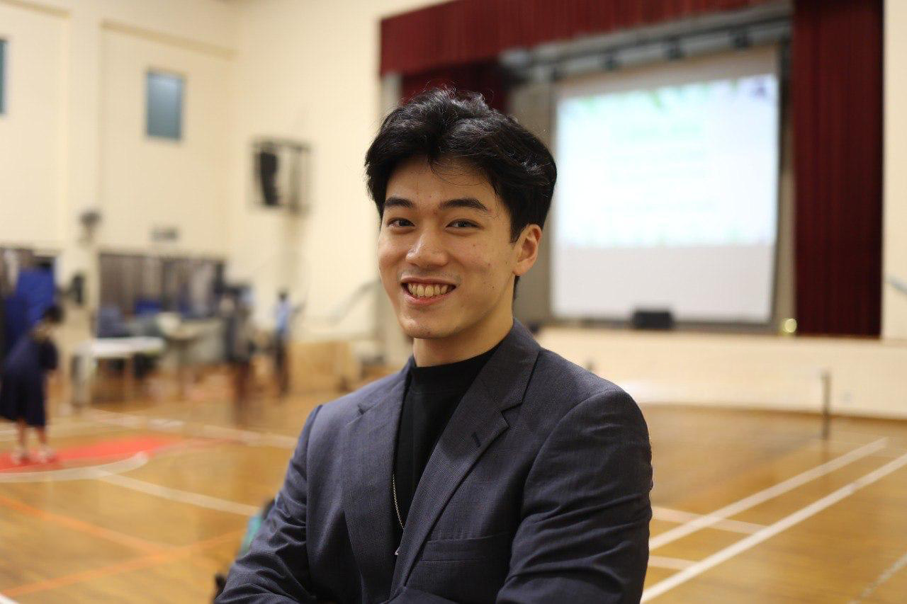

We are a team based in the [School of Computing, National University of Singapore](http://www.comp.nus.edu.sg).

## Project team

### Jed

[[github](https://github.com/jedkohjk)]
[[portfolio](team/jedkohjk.md)]

* Role: Frontend Engineer | Testing Engineer
* Responsibilities: Software Development | UI & UX | Unit & Integration Testing

### Nguyen Cao Duy

[[github](https://github.com/ncduy0303)]
[[portfolio](team/ncduy0303.md)]

* Role: Site Reliability Engineer | DevOps Engineer
* Responsibilities: Software Development | Build & Deployment | CI / CD 

### Nathaniel Calimag

[[github](http://github.com/nathanielcalimag)]
[[portfolio](team/nathanielcalimag.md)]

* Role: Backend Engineer | Quality Assurance
* Responsibilities: Software Development | Schema Design | Code Quality

### Khoo Wui Hong

[[github](http://github.com/wui-hong)]
[[portfolio](team/wui-hong.md)]

* Role: Business Analyst | Integration Engineer
* Responsibilities: Development | Requirements & Documentation | Systems Integration

### Jeffrey Jian

[[github](http://github.com/jeffrey-jian)]
[[portfolio](team/jeffrey-jian.md)]

* Role: Software Architect | Optimisation
* Responsibilities: Development | Software Design | Automation
