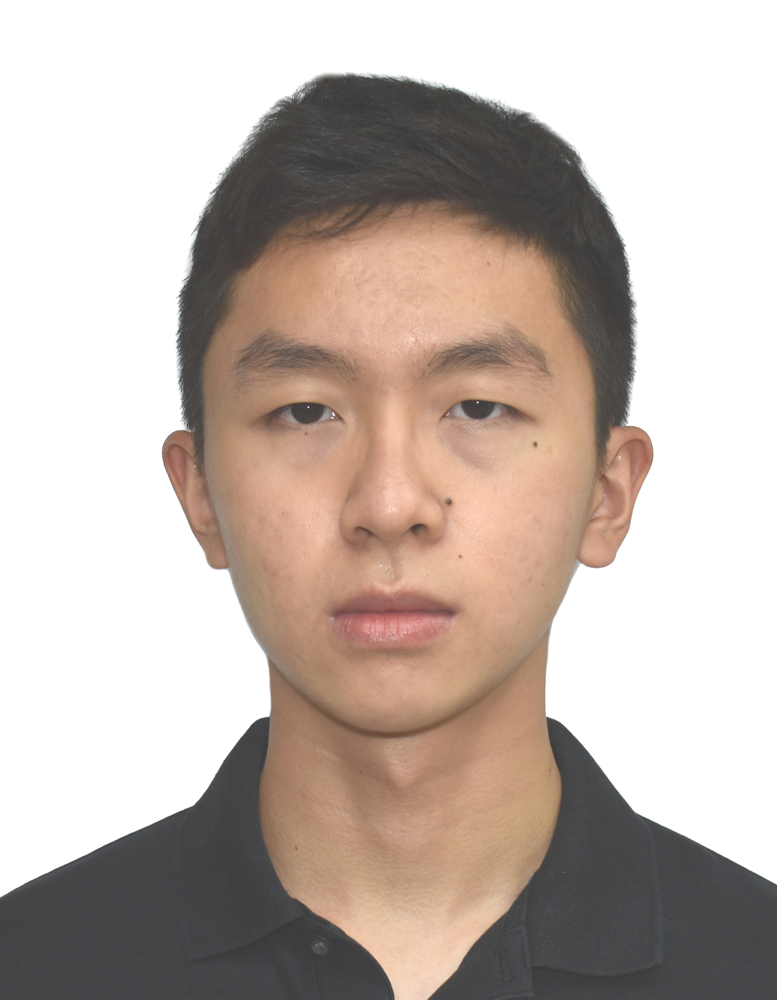

We are a team based in the [School of Computing, National University of Singapore](http://www.comp.nus.edu.sg).

## Project team

### Jed

[[github](https://github.com/jedkohjk)]
[[portfolio](team/jedkohjk.md)]

* Role: Software Engineer
* Responsibilities: Development, Code Reviews, Unit / Integration Testing

### Nguyen Cao Duy

[[github](https://github.com/ncduy0303)]
[[portfolio](team/ncduy0303.md)]

* Role: Software Engineer
* Responsibilities: Development, Code Reviews, Requirements

### Nathaniel Calimag

[[github](http://github.com/nathanielcalimag)]
[[portfolio](team/nathanielcalimag.md)]

* Role: Software Engineer
* Responsibilities: Development, Project Management, Code Quality

### Khoo Wui Hong

[[github](http://github.com/wui-hong)]
[[portfolio](team/wui-hong.md)]

* Role: Software Engineer
* Responsibilities: Development, Documentation, Project Management

### Jeffrey Jian

[[github](http://github.com/jeffrey-jian)]
[[portfolio](team/jeffrey-jian.md)]

* Role: Software Engineer
* Responsibilities: Development, Code Quality, Scheduling
