* Table of Contents
{:toc}

--------------------------------------------------------------------------------------------------------------------

## **Acknowledgements**

We would like to acknowledge the following third-party libraries, frameworks and sources for their use in Spend n Split:

**Development**

* **[Jackson](https://github.com/FasterXML/jackson)**: The Java JSON library for parsing and creating JSON for SnS.

* **[JUnit 5](https://junit.org/junit5/)**: The Java testing framework of SnS.

* **[Apache Common Numbers](https://github.com/apache/commons-numbers/tree/master)**: The Java numbers library that enhance SnS' precision.

**Gradle**

* **[Checkstyle](https://docs.gradle.org/current/userguide/checkstyle_plugin.html)**: The Gradle plugin that ensures consistent and appropriate code style.

* **[Shadow](https://github.com/johnrengelman/shadow)**: The Gradle plugin for creating fat JARs for SnS.

* **[Jacoco](https://github.com/palantir/gradle-jacoco-coverage)**: The Gradle plugin for generating code coverage reports.

**User Interface**

* **[JavaFX](https://openjfx.io/)**: The GUI framework of SnS.

* **[Poppins Font](https://fonts.google.com/specimen/Poppins)**: The primary font used in SnS.

* **[Tailwind CSS Colors](https://tailwindcss.com/docs/customizing-colors)**: The colour palette that inspired the SnS colour scheme.

**Others**

* **[Address Book 3](https://se-education.org/addressbook-level3/)**: The project SnS is based on.

* **[Jekyll](https://github.com/jekyll/jekyll)**: The static site generator that converts SnS markdown documentation into web pages.

--------------------------------------------------------------------------------------------------------------------

## **Setting up, getting started**

Refer to the guide [_Setting up and getting started_](SettingUp.md).

--------------------------------------------------------------------------------------------------------------------

## **Design**

<div markdown="span" class="alert alert-primary">

:bulb: **Tip:** The `.puml` files used to create diagrams in this document `docs/diagrams` folder. Refer to the [_PlantUML Tutorial_ at se-edu/guides](https://se-education.org/guides/tutorials/plantUml.html) to learn how to create and edit diagrams.
</div>

### Architecture


The ***Architecture Diagram*** given above explains the high-level design of the App.

Given below is a quick overview of main components and how they interact with each other.

**Main components of the architecture**

**`Main`** (consisting of classes [`Main`](https://github.com/se-edu/addressbook-level3/tree/master/src/main/java/seedu/address/Main.java) and [`MainApp`](https://github.com/se-edu/addressbook-level3/tree/master/src/main/java/seedu/address/MainApp.java)) is in charge of the app launch and shut down.
* At app launch, it initializes the other components in the correct sequence, and connects them up with each other.
* At shut down, it shuts down the other components and invokes cleanup methods where necessary.

The bulk of the app's work is done by the following four components:

* [**`UI`**](#ui-component): The UI of the App.
* [**`Logic`**](#logic-component): The command executor.
* [**`Model`**](#model-component): Holds the data of the App in memory.
* [**`Storage`**](#storage-component): Reads data from, and writes data to, the hard disk.

[**`Commons`**](#common-classes) represents a collection of classes used by multiple other components.

**How the architecture components interact with each other**

The *Sequence Diagram* below shows how the components interact with each other for the scenario where the user issues the command `delete 1`.

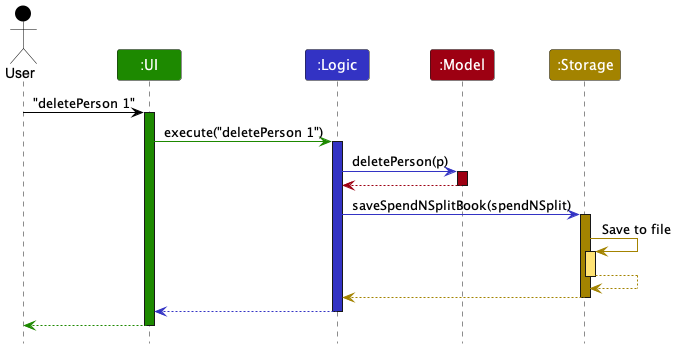

Each of the four main components (also shown in the diagram above),

* defines its *API* in an `interface` with the same name as the Component.
* implements its functionality using a concrete `{Component Name}Manager` class (which follows the corresponding API `interface` mentioned in the previous point).

For example, the `Logic` component defines its API in the `Logic.java` interface and implements its functionality using the `LogicManager.java` class which follows the `Logic` interface. Other components interact with a given component through its interface rather than the concrete class (reason: to prevent outside component's being coupled to the implementation of a component), as illustrated in the (partial) class diagram below.


The sections below give more details of each component.

### UI component

The **API** of this component is specified in [`Ui.java`](https://github.com/AY2324S1-CS2103T-W17-3/tp/blob/master/src/main/java/seedu/spendnsplit/ui/Ui.java)

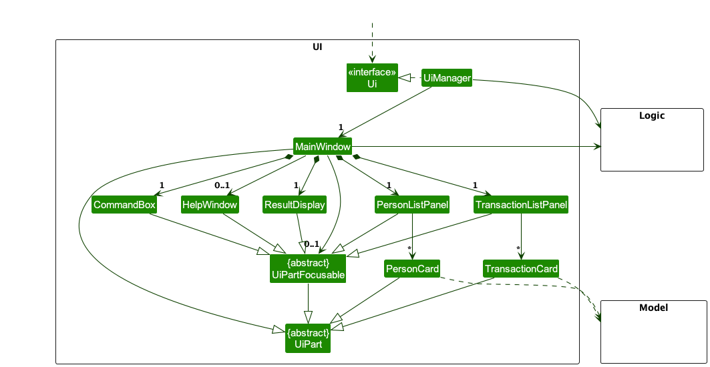

The UI consists of a `MainWindow` that is made up of parts e.g.`CommandBox`, `ResultDisplay`, `PersonListPanel` etc. Some parts are made up of even smaller parts. All of these parts, including the `MainWindow`, are subclasses of the abstract `UiPart` class which captures the commonalities between classes that represent parts of the visible GUI. 

Some parts (`PersonListPanel`, `TransactionListPanel`, `PersonCard`, `CommandBox`, `ResultDisplay`, `HelpWindow`) inherit from `UiPartFocusable` (a subclass of `UiPart`) which enables the to be focused on. This is used for the keyboard navigation feature as `MainWindow` keeps track of the currently focused part and can switch focus to another part when certain keyboard shortcuts are pressed.

The `UI` component uses the JavaFx UI framework. The layout of these UI parts are defined in matching `.fxml` files that are in the `src/main/resources/view` folder. For example, the layout of the [`MainWindow`](https://github.com/AY2324S1-CS2103T-W17-3/tp/blob/master/src/main/java/seedu/spendnsplit/ui/MainWindow.java) is specified in [`MainWindow.fxml`](https://github.com/AY2324S1-CS2103T-W17-3/tp/blob/master/src/main/resources/view/MainWindow.fxml)

The `UI` component,

* executes user commands using the `Logic` component.
* listens for changes to `Model` data so that the UI can be updated with the modified data.
* keeps a reference to the `Logic` component, because the `UI` relies on the `Logic` to execute commands.
* depends on some classes in the `Model` component, as it displays `Person` and `Transaction` objects residing in the `Model`.

### Logic component

**API** : [`Logic.java`](https://github.com/se-edu/addressbook-level3/tree/master/src/main/java/seedu/address/logic/Logic.java)

Here's a (partial) class diagram of the `Logic` component:

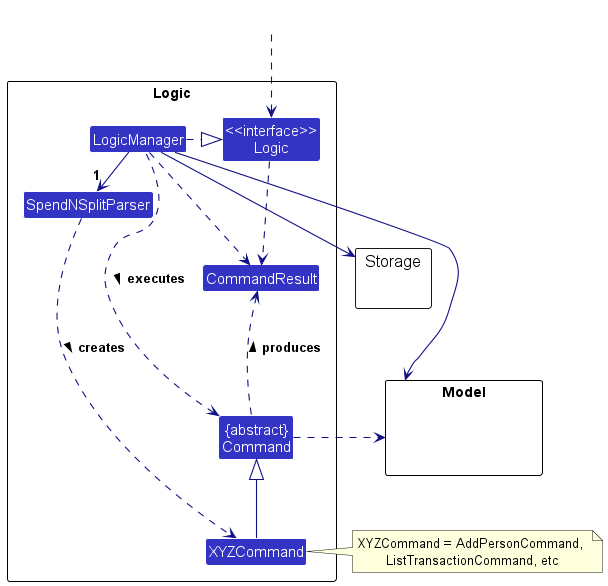

The sequence diagram below illustrates the interactions within the `Logic` component, taking `execute("deletePerson 1")` API call as an example.


How the `Logic` component works:

1. When `Logic` is called upon to execute a command, it is passed to an `SpendNSplitParser` object together with a `CommandAliasMap` map.
2. The `SpendNSplitParser` in turn creates a parser that matches the command (e.g., `DeletePersonCommandParser`) and uses it to parse the command.
3. This results in a `Command` object (more precisely, an object of one of its subclasses e.g., `DeletePersonCommand`) which is executed by the `LogicManager`.
4. The command can communicate with the `Model` when it is executed (e.g. to delete a person).
5. The result of the command execution is encapsulated as a `CommandResult` object which is returned back from `Logic`.

Here are the other classes in `Logic` (omitted from the class diagram above) that are used for parsing a user command:

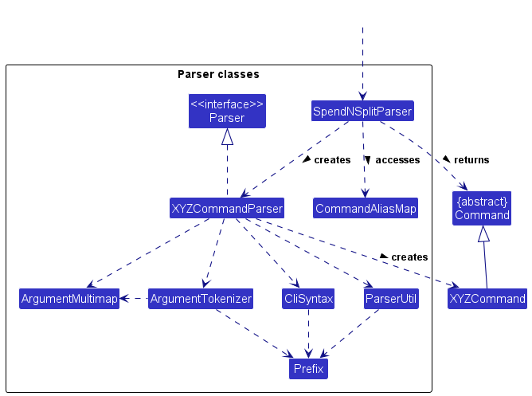

How the parsing works:
* When called upon to parse a user command, the `SpendNSplitParser` accesses the `CommandAliasMap` to match any aliases and identify the corresponding command word.
* The `SpendNSplitParser` then creates an `XYZCommandParser` (`XYZ` is a placeholder for the specific command name e.g., `AddTransactionCommandParser`) which uses the other classes shown above to parse the user command and create a `XYZCommand` object (e.g., `AddTransactionCommand`) which the `SpendNSplitParser` returns back as a `Command` object.
* All `XYZCommandParser` classes (e.g., `AddPersonCommandParser`, `DeleteTransactionCommandParser`, ...) inherit from the `Parser` interface so that they can be treated similarly where possible e.g, during testing.

### Model component
**API** : [`Model.java`](https://github.com/se-edu/addressbook-level3/tree/master/src/main/java/seedu/address/model/Model.java)

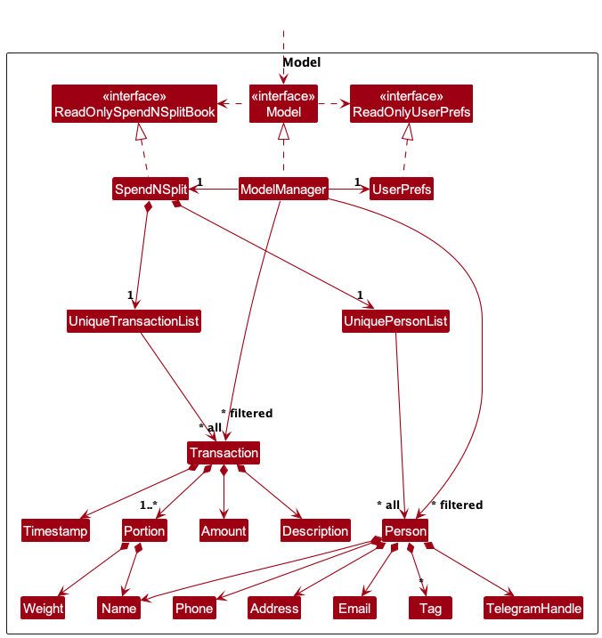

The `Model` component,

* stores the Spend N Split data i.e., all `Person` objects (which are contained
in a `UniquePersonList` object) and all `Transaction` objects (which are contained
in a `UniqueTransactionList` object).
* stores the currently 'selected' `Person` and `Transaction` objects (e.g., results
of a search query) as separate _filtered_ lists which are exposed to outsiders as
unmodifiable `ObservableList<Person>` and `ObservableList<Transaction>` lists that
can be 'observed' e.g. the UI can be bound to these lists so that the UI automatically
updates when the data in the lists change.
* stores a `UserPref` object that represents the user’s preferences. This is exposed
to the outside as a `ReadOnlyUserPref` objects.
* does not depend on any of the other three components (as the `Model` represents
data entities of the domain, they should make sense on their own without depending
on other components)

### Storage component

**API** : [`Storage.java`](https://github.com/se-edu/addressbook-level3/tree/master/src/main/java/seedu/address/storage/Storage.java)

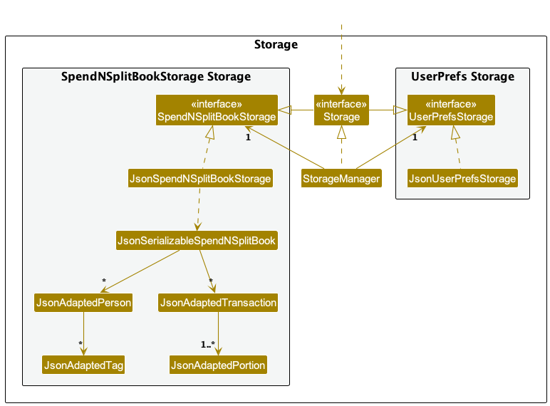

The `Storage` component,
* can save both Spend N Split data and user preference data in JSON format, and read them back into corresponding objects.
* inherits from both `SpendNSplitBookStorage` and `UserPrefStorage`, which means it can be treated as either one (if only the functionality of only one is needed).
* depends on some classes in the `Model` component (because the `Storage` component's job is to save/retrieve objects that belong to the `Model`)

### Common classes

Classes used by multiple components are in the `seedu.addressbook.commons` package.

--------------------------------------------------------------------------------------------------------------------

## **Implementation**

This section describes some noteworthy details on how certain features are implemented.

### Keyboard Navigation Feature

#### Overview

The keyboard navigation feature allows users to navigate between different UI components using predefined keyboard shortcuts. This feature enhances fast-typing users' experience by allowing them to navigate the UI without having to use the mouse.

#### Implementation

The implementation of this feature is centered in the `MainWindow` class, which acts as the primary UI container for the application. Within `MainWindow`, two key methods are used: [`setKeyNavigation`](https://github.com/AY2324S1-CS2103T-W17-3/tp/blob/master/src/main/java/seedu/spendnsplit/ui/MainWindow.java#L148) and [`setKeyNavigations`](https://github.com/AY2324S1-CS2103T-W17-3/tp/blob/master/src/main/java/seedu/spendnsplit/ui/MainWindow.java#L115). The `setKeyNavigations` utilizes `setKeyNavigation` to assign specific keyboard events to different UI parts.

The [`focusedUiPart`](https://github.com/AY2324S1-CS2103T-W17-3/tp/blob/master/src/main/java/seedu/spendnsplit/ui/MainWindow.java#L34) field in `MainWindow` keeps track of the currently focused UI part. When the user presses a key combination that matches the one assigned to a UI part, the currently focused UI part (if existed) will be unfocused and then assigned to the newly focused UI part. The newly focused UI part will then be focused.

### Person-related Features


The `Person` class is the main class in the `seedu.spendnsplit.model.person` package. It represents a person in the application and is composed of the following classes:

* `Name`: The name of the person. It must be unique and cannot be null.
* `Phone`: The phone number of the person.
* `Email`: The email address of the person.
* `Address`: The address of the person.
* `TelegramHandle`: The telegram handle of the person.
* `Tags`: The tags associated with the person.

All `Person` objects are stored in `UniquePersonList` in `Model`.

#### Adding a Person

The `addPerson` command creates a new `Person` object with the details provided by the user.

The activity diagram below shows an overview of the `addPerson` command:


The sequence diagram below shows the interactions within the `Logic` component when user runs the `addPerson` command:


The overall flow of the `addPerson` command is as follows:

1. The user specifies the details of the person to be added. Note that name is the only mandatory field.
2. The parsers check for the presence of the mandatory name field as well as the validity of all provided fields. Errors are raised if any of the fields are invalid.
3. Upon successful parsing, the `AddPersonCommand` is created with the person object to be added to the model.
4. The `AddPersonCommand` is executed by the `LogicManager`, which attempts to add the person to the model through `Model::addPerson(newPerson)`. Errors are raised if the person already exists in the model (duplicate name).
5. Upon successful execution, a `CommandResult` object is returned which contains the success message to be displayed to the user.

#### Editing a Person

The `editPerson` command edits an existing `Person` object with the details provided by the user.

The activity diagram below shows an overview of the `editPerson` command:


The sequence diagram below shows the interactions within the `Logic` component when user runs the `editPerson` command:


Since the `editPerson` command might affect the `Transaction` objects stored in the model, the sequence diagram below extends the previous sequence diagram to show the interactions within the `Model` component:


Key points to note:

- `UniquePersonList::setPerson` updates the `Person` object in the list.
- `UniqueTransactionList::setPerson` changes the `Name` fields of all `Transaction` objects in the list that involve the person to be edited to the new name.
- `SpendNSplit::syncNames` ensures the consistency of the casing of all `Name` fields in the model after the command.
- `SpendNSplit::sortPersons` ensures the consistency of the ordering of all `Person` objects in the model after the command.

The overall flow of the `editPerson` command is as follows:

1. The user specifies the index of the person to be edited and the details to be edited.
2. The parsers check for the presence of the mandatory index field as well as the validity of all provided fields. Errors are raised if any of the fields are invalid.
3. Upon successful parsing, the `EditPersonCommand` is created with the index of the person to be edited and the details to be edited expressed as an `PersonDescriptor` object.
4. The `EditPersonCommand` is executed by the `LogicManager`, which attempts to edit the person in the model through `Model::setPerson(personToEdit, editedPerson)`. Errors are raised if the index exceeds the number of persons currently displayed in `Model::getFilteredPersonList()` or if the edited person already exists in the model (duplicate name).
5. Upon successful execution, a `CommandResult` object is returned which contains the success message to be displayed to the user. 
6. Note that the displayed list of persons will be updated to show all persons in the model after the edit through `Model::updateFilteredPersonList(PREDICATE_SHOW_ALL_PERSONS)`.

#### Deleting a Person

The `deletePerson` command deletes an existing `Person` object.

The activity diagram below shows an overview of the `deletePerson` command:


The sequence diagram below shows the interactions within the `Logic` component when user runs the `deletePerson` command:


Since the `deletePerson` command might affect the `Transaction` objects stored in the model, the sequence diagram below extends the previous sequence diagram to show the interactions within the `Model` component:


Key points to note:

- `UniquePersonList::remove` removes the `Person` object from the list.
- `UniqueTransactionList::deletePerson` updates the `Name` fields of all `Transaction` objects in the list that involve the person to be deleted to `Name.OTHERS`. If the updated `Transaction` object is not valid (not involving any other known person), it is removed from the list.
- `SpendNSplit::sortPersons` ensures the consistency of the ordering of all `Person` objects in the model after the command.

The overall flow of the `deletePerson` command is as follows:

1. The user specifies the index of the person to be deleted.
2. The parsers check for the presence of the mandatory index field. Errors are raised if the index is invalid.
3. Upon successful parsing, the `DeletePersonCommand` is created with the index of the person to be deleted.
4. The `DeletePersonCommand` is executed by the `LogicManager`, which attempts to delete the person from the model through `Model::deletePerson(personToDelete)`. Errors are raised if the index exceeds the number of persons currently displayed in `Model::getFilteredPersonList()`.
5. Upon successful execution, a `CommandResult` object is returned which contains the success message to be displayed to the user.

#### Listing Persons

The `listPerson` command lists existing `Person` objects with names matching the keywords provided by the user. If no keywords are provided, all `Person` objects are listed.

The activity diagram below shows an overview of the `listPerson` command:


The sequence diagram below shows the interactions within the `Logic` component when user runs the `listPerson` command:


The overall flow of the `listPerson` command is as follows:

1. The user specifies the keywords to be matched.
2. The parsers check for the validity of the provided keywords. Errors are raised if the keywords are invalid.
3. Upon successful parsing, the `ListPersonCommand` is created with the keywords to be matched expressed as a `NameContainsKeywordsPredicate` object which implements the `Predicate<Person>` interface.
4. The `ListPersonCommand` is executed by the `LogicManager`, which attempts to update the displayed list of persons through `Model::updateFilteredPersonList(predicate)`.
5. Upon successful execution, a `CommandResult` object is returned which contains the success message to be displayed to the user.

#### Sorting Persons

The `sortPerson` command sorts displayed `Person` objects by the specified order.

The activity diagram below shows an overview of the `sortPerson` command:


The sequence diagram below shows the interactions within the `Logic` component when user runs the `sortPerson` command:


The overall flow of the `sortPerson` command is as follows:

1. The user specifies the order to be sorted by. It is the only mandatory field and must be `+` (ascending) or `-` (descending).
2. The parsers check for the validity of the provided order. Errors are raised if the order is invalid.
3. Upon successful parsing, the `SortPersonCommand` is created with the order to be sorted by expressed as a boolean value.
4. The `SortPersonCommand` is executed by the `LogicManager`, which attempts to update the displayed list of persons through `Model::sortPersonAscending()` or `Model::sortPersonDescending()`.
5. Upon successful execution, a `CommandResult` object is returned which contains the success message to be displayed to the user.

### Transaction-related Features

#### Adding Transactions

##### Settling Balances

#### Editing Transactions

Editing transactions mechanism is facilitated by `EditTransactionCommand`. It extends `Command` with the ability to edit a transaction.

It consists of the following classes:

* `EditTransactionCommand`— Represents a command to edit a transaction.
* `EditTransactionCommandParser`— Parses user input into a `EditTransactionCommand`.
* `EditTransactionDescriptor`— Stores the details to edit the transaction with. Each non-empty field value will replace the corresponding field value of the transaction.

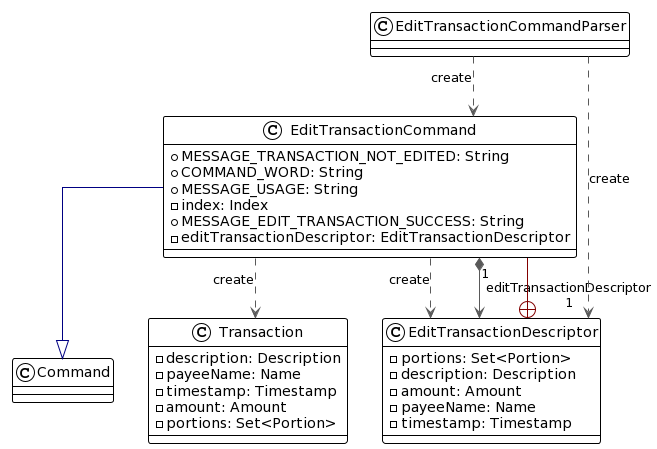

**Note**: The above class diagram is to be updated to reflect the new implementation, with the addition of `UpdateExpenseCommand`.

Upon execution, `EditTransactionCommand` will retrieve the transaction to be edited from `filteredTransactionList` from `Model`, create a copy of the `Transaction` object with the new details, then replace the old `Transaction` object with the new one in `filteredTransactionList`.

We chose this method of execution instead of directly editing the `Transaction` object in `filteredTransactionList` because `Model` re-renders the UI only when `filteredTransactionList` is updated. If we were to edit the `Transaction` object directly, `Model` would not be able to detect the change and re-render the UI.

##### Updating Portions

#### Deleting Transactions

#### Duplicating Transactions

#### Filtering Transactions

### Other Features

#### Setting Shorthands

##### Overview

The `setShorthand` command allows users to set a shorthand, or alias for an existing command. This shorthand can then be used in place of the command.

The activity diagram is as follows:

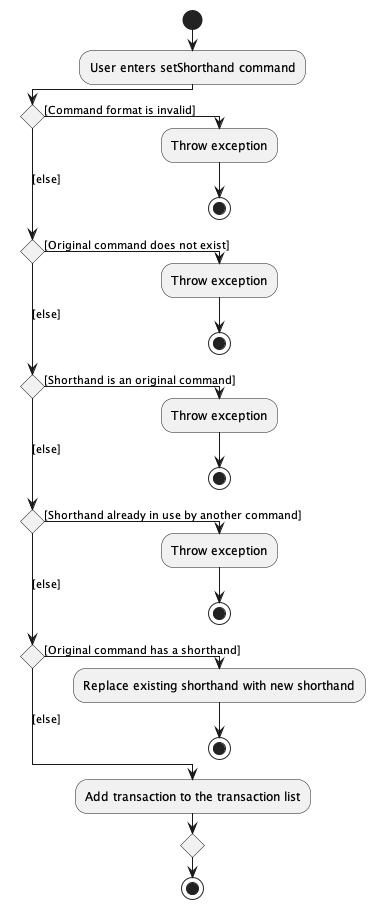

The sequence diagram below illustrates the interactions within the `Logic` component and `Model` component:

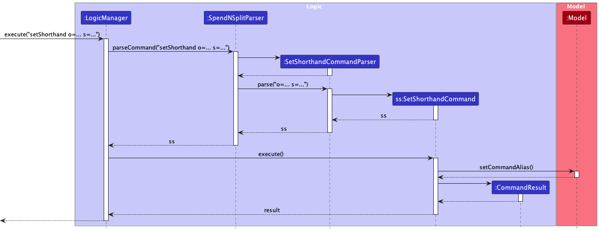

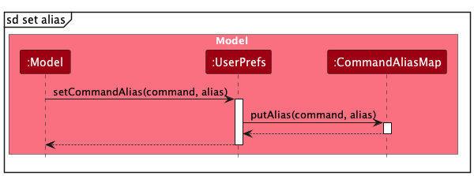

##### Feature Details

1. The user specifies the original command and the new shorthand in the `setShorthand` command.
2. If the original command is invalid or does not exist, the user will be informed of the error.
3. If the shorthand is already an existing original command, the user will be informed of the error.
4. If the shorthand is already being used as a shorthand for another command, the user will be informed of the error.
5. If the original command has an existing shorthand, the new shorthand will replace the existing shorthand.

##### Implementation Considerations

All existing commands are stored in a hashset. Newly created shorthands are stored in a hashmap. 
Upon executing a new command, the parser looks up the command word in the existing commands hashset first.
If the command word does not exist within the hashset, the parser then looks up the command word in the shorthands hashmap.

The shorthand allows each original command to have up to one and only one shorthand.
This is to prevent ambiguity when the user enters a shorthand that is used by multiple original commands, 
as well as confusion when an original command could have multiple shorthands.

#### Clearing App Data

##### Overview

The `clear` command allows users to clear all data stored in the app.
This includes all persons and transactions in the `spendnsplitbook.json` file,
as well as all shorthands in the `preferences.json` file.

This command is irreversible, and should be used with caution. This command is introduced for new users to be able to quickly
clear the sample data and start using the app with their own data. 
Should the user ever wish to clear the data and start afresh again in the future, they can also use this command.

The sequence diagram below illustrates the interactions within the `Logic` component and `Model` component:

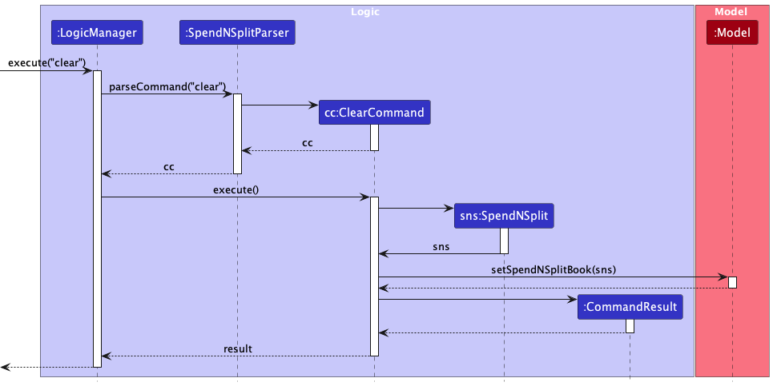

##### Feature Details

1. The user specifies the `clear` command.
2. The app clears all data from its Storage, and displays empty person and transaction lists.

#### Accessing Help

##### Overview

The `help` command brings up the help window, which contains a URL link to the online user guide.

The sequence diagram below illustrates the interactions within the `Ui`, `Logic` and `Model` component:

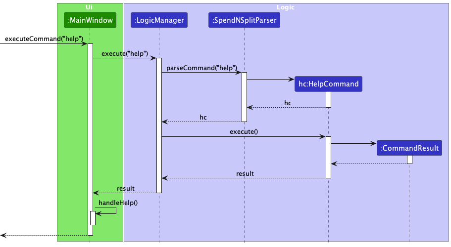

##### Feature Details

1. The user specifies the `help` command.
2. The app opens the help window and centers it on the screen.

#### Exiting the App

##### Overview

The `exit` command exits the app. This closes the app window (including the help window if opened) and terminates the app.

The sequence diagram below illustrates the interactions within the `Ui`, `Logic` and `Model` component:

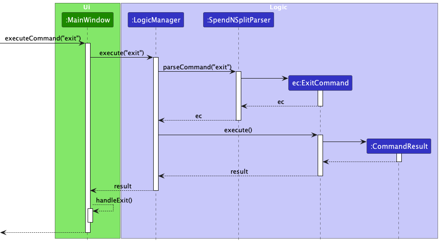

##### Feature Details

1. The user specifies the `exit` command.
2. The app closes the app window and terminates the app.

--------------------------------------------------------------------------------------------------------------------

## **Documentation, logging, testing, configuration, dev-ops**

* [Documentation guide](Documentation.md)
* [Testing guide](Testing.md)
* [Logging guide](Logging.md)
* [Configuration guide](Configuration.md)
* [DevOps guide](DevOps.md)

--------------------------------------------------------------------------------------------------------------------

## **Appendix: Requirements**

### Product scope

**Target User Profile**: University students who live in hall
* needs to manage a significant number of contacts and transactions
* often splits expenses with other hallmates (for groceries, meals, events etc.)
* often has their laptop on hand and prefer desktop apps
* used to typing fast on their laptop
* is reasonably comfortable using CLI apps

**Value Proposition**: The app will allow users to seamlessly keep track of the
money they owe/are owed across their contacts, in regard to borrowers/lenders and
their expenses. It is CLI-based and manages contacts faster than a typical mouse/GUI driven app.

### User stories

Priorities: High (must have) - `* * *`, Medium (nice to have) - `* *`, Low (unlikely to have) - `*`

| Priority | As a …​       | I want to …​                            | So that I can…​                                                         |
|----------|---------------|-----------------------------------------|-------------------------------------------------------------------------|
| `* * *`  | new user      | see usage instructions                  | learn how to use the application easily                                 |
| `* * *`  | new user      | view sample contacts and transactions   | familiarise myself with the application's data                          |
| `* * *`  | user          | add a new person                        | save new contacts for expense tracking                                  |
| `* * *`  | user          | delete a person                         | remove contacts that I no longer need to track                          |
| `* * *`  | user          | edit a person                           | update the details of a contact                                         |
| `* *`    | user          | find a person by name                   | locate contact details quickly without searching through all contacts   |
| `* * *`  | user          | add a transaction involving my contacts | track shared expenses with my contacts                                  |
| `* * *`  | user          | delete a transaction                    | remove transactions that I no longer need to track                      |
| `* * *`  | user          | edit a transaction                      | update the details of a transaction                                     |
| `* *`    | user          | duplicate a transaction                 | recreate similar transactions easily                                    |
| `* *`    | user          | add recurring transactions              | automatically create regular transactions                               |
| `* * *`  | user          | view balances with a person             | track how much I owe or am owed from a person                           |
| `* * *`  | user          | settle my balance with a person         | clear any outstanding debts with a person from all transactions at once |
| `* * *`  | user          | find transactions by a person's name    | view transactions that involve a specific person                        |
| `* *`    | user          | sort my contacts by balance             | view the largest outstanding balances within my contacts                |
| `*`      | advanced user | add a command alias                     | type common commands quickly through shorthands                         |
| `*`      | advanced user | delete a command alias                  | remove shorthands that I no longer need                                 |
| `*`      | advanced user | edit a command alias                    | update shorthands                                                       |
| `*`      | user          | add attachments to transactions         | verify my transactions using receipts that I can refer to               |
| `*`      | user          | undo my last command                    | recover from a command I have ran by mistake                            |
| `*`      | user          | redo my last undo                       | reverse an undo command I ran by mistake                                |

*{More to be added}*

### Use cases

(For all use cases below, the **System** is the `Spend n Split` and the **Actor** is the `user`, unless specified otherwise)

---

**Use Case: UC1 - Adding a New Person**

**MSS**

1. User requests to add a new person.
2. Spend n Split informs the user that the new person has been added.
3. Spend n Split shows the updated contact list.

Use case ends.

**Extensions**
* 1a. Spend n Split detects that the person already exists in the contact list.
    * 1a1. Spend n Split informs the user that the person already exists in the contact list.
    * Use case ends.
* 1b. Spend n Split detects an error in the entered data for the new person.
    * 1b1. Spend n Split informs the user that the data entered is invalid and requests for correct data.
    * 1b2. User enters new data.
    * Steps 1b1 - 1b2 are repeated until the data entered is correct.
    * Use case resumes at step 2.

---

**Use Case: UC2 - Editing a Person**

**MSS**

1. User requests to edit a person.
2. Spend n Split informs the user that the person has been edited.
3. Spend n Split shows the updated contact list.

Use case ends.

**Extensions**
* 1a. Spend n Split detects that the person does not exist in the contact list.
    * 1a1. Spend n Split informs the user that the person does not exist in the contact list.
    * Use case ends.
* 1b. Spend n Split detects an error in the entered data for the person.
    * 1b1. Spend n Split informs the user that the data entered is invalid and requests for correct data.
    * 1b2. User enters new data.
    * Steps 1b1 - 1b2 are repeated until the data entered is correct
    * Use case resumes at step 2.

---

**Use Case: UC3 - Deleting a Person**

**MSS**

1. User requests to delete a person.
2. Spend n Split informs the user that the person has been deleted.
3. Spend n Split shows the updated contact list.

Use case ends.

**Extensions**
* 1a. Spend n Split detects that the person does not exist in the contact list.
    * 1a1. Spend n Split informs the user that the person does not exist in the contact list.
    * Use case ends.

---

**Use Case: UC4 - Listing all Persons**

**MSS**

1. User requests to view all contacts in the contact list with optional keywords to filter by names.
2. Spend n Split shows a list of contacts, filtered by names if optional keywords were included.

Use case ends.

---

**Use Case: UC5 - Add a New Transaction**

**MSS**

1. User requests to add a new transaction.
2. Spend n Split informs the user that the new transaction has been added.
3. Spend n Split shows the updated transaction list.

Use case ends.

**Extensions**
* 1a. At least one person in the transaction does not exist in the contact list.
    * 1a1. Spend n Split informs the user that there are persons that do not exist in the contact list.
    * Use case ends

* 1b. Spend n Split detects an error in the entered data for the new transaction.
    * 1b1. Spend n Split informs the user that the data entered is invalid and requests for the correct data.
    * 1b2. User enters new data.
    * Steps 1b1 - 1b2 are repeated until the data entered is correct.
    * Use case resumes at step 2.

---

**Use Case: UC6 - Edit a Transaction**

**MSS**

1. User requests to edit a transaction.
2. Spend n Split informs the user that the transaction has been edited.
3. Spend n Split shows the updated transaction list.

Use case ends.

**Extensions**
* 1a. Transaction does not exist in the transactions list.
  * 1a1. Spend n Split informs the user that the transaction does not exist in the transactions list.
  * Use case ends.

* 1b. Spend n Split detects an error in the entered data for the transaction.
  * 1b1. Spend n Split informs the user that the data entered is invalid and requests for correct data.
  * 1b2. User enters new data.
  * Steps 1b1 - 1b2 are repeated until the data entered is correct.
  * Use case resumes at step 2.

---

**Use Case: UC7 - Delete a Transaction**

**MSS**

1. User requests to delete a transaction.
2. Spend n Split informs the user that the transaction has been deleted.
3. Spend n Split shows the updated transaction list.

Use case ends.

**Extensions**
* 1a. Spend n Split detects that the transaction does not exist in the portion list.
    * 1a1. Spend n Split informs the user that the transaction does not exist in the transaction list.
    * Use case ends.
    
---

**Use Case: UC8 - Settle with a person**

**MSS**

1. User requests to settle with a person.
2. Spend n Split informs the user that all the outstanding balance with the person have been settled.
3. Spend n Split shows the list of contacts.

Use case ends.

**Extensions**
* 1a. Person does not exist in the contact list.
  * 1a1. Spend n Split informs the user that the person does not exist in the contact list.
  * Use case ends.

* 1b. User does not have an outstanding balance with the person.
  * 1b1. Spend n Split informs the user that there is no outstanding balance with that person.
  * Use case ends.

---

**Use Case: UC9 - Duplicate a Transaction**

**MSS**

1. User requests to duplicate a transaction.
2. Spend n Split informs the user that all the new duplicated transaction has been added.
3. Spend n Split shows the updated list of transactions.

Use case ends.

**Extensions**
* 1a. Spend n Split detects that the transaction does not exist in the portion list.
    * 1a1. Spend n Split informs the user that the transaction does not exist in the transaction list.
    * Use case ends.

* 1b. Spend n Split detects an error in the entered data for the duplicated transaction.
    * 1b1. Spend n Split informs the user that the data entered is invalid and requests for correct data.
    * 1b2. User enters new data.
    * Steps 1b1 - 1b2 are repeated until the data entered is correct.
    * Use case resumes at step 2.

* 1c. Spend n Split detects that the duplicated transaction already exists in the transactions list.
    * 1c1. Spend n Split informs the user that the duplicated transaction already exists in the transactions list.
    * Use case ends.

---

**Use Case: UC10 - Listing Transactions**

**MSS**

1. User requests to view the transaction list with optional keywords and names to filter the list.
2. Spend n Split shows the list of transactions, which is filtered if optional keywords and / or names were included.

Use case ends.

---


### Non-Functional Requirements

1.  The application should work on any _mainstream OS_ as long as it has Java `11` or above installed.
2.  The application should be able to hold up to 1000 people without a noticeable sluggishness in performance for typical usage.
3.  A user with above average typing speed for regular English text (i.e, not code, not system admin commands) should be able to accomplish most of the tasks faster using commands than using the mouse.
4.  The application should work without internet access.
5.  The application should not take more than 50MB of space.
6.  The user interface should be intuitive to new users. From the interface, users should easily find out how to write input, view output, and find the help guide.
7.  The application should be accurate when calculating portions, being able to handle the division of costs with precision.
8.  The application should store data to the hard disk consistently so that loading the data on a different device leads to the same application state.
9.  The GUI should organise and present data clearly so that users are able to read application details easily.

### Glossary
#### Address
The particulars of the place where a person lives.
#### Alphanumeric
Consisting of only letters (a-z, A-Z) or numbers or both.
#### Amount
The total value of the transaction.
#### Balance
The amount of money that you owe a person or the amount of money that they owe you. A positive balance under a person
means that they owe you money, whereas a negative balance means that you owe them money.
#### Card
A rectangular area in our application that either describes the full details of a transaction or person.
#### Command
To use and control the application, commands are necessary. To utilise a feature, a command has to be typed into the Command Input Field and executed.
#### Cost
The total value of the transaction.
#### Description
A written account of a transaction, used to provide context and details about the transaction.
#### Email address
A unique identifier for an email account. It identifies an email box to which messages and emails are delivered.
#### Field
An area where text can be input.
#### Flag
Flags are used to modify the operation of a command.
#### GUI
GUI stands for Graphical User Interface. A Graphical User Interface uses icons and mouse inputs from users to allow them to interact with the application.
#### Index
A number representing the position of an item in a list.
#### Integer
A number that is a not a fraction. E.g. whole numbers such as -10, 0, 1, 5.
#### Keyword
An important word that is used by the application to process various commands.
#### Mainstream OS
Refers to operating systems such as Windows, Linux, Unix, MacOS.
#### Name
A word or set of words that are used to address or refer to a person.
#### Negative
A numerical value that is less than 0.
#### Parameter
An additional input that provides further details on a command that a user is executing.
#### Payee
Refers to the person that paid for the transaction.
#### Payer
Refers to a person that owes the payee money for the transaction.
#### Person
An individual that can be associated with various information in our application, such as contact information and balances.
#### Phone number
A sequence of digits that is dialled on a telephone to contact a person.
#### Portion
A subset of a transaction. A transaction is split into multiple portions.
#### Positive
A numerical value that is greater than 0.
#### Settle
Refers to the act of two people exchanging money, such that their respective balances with each other equal zero after the transaction.
#### Shorthand
A shortened version of a command.
#### Tag
A label that can be applied to a person to provide additional details about them.
#### Telegram handle
A unique identifier for a Telegram account. E.g. @ryanlim123
#### Timestamp
Refers to the time the transaction occurred. Timestamps in our application are displayed in the "DD/MM/YYYY HH:MM" format. DD refers to Day, MM refers to Month,
YYYY refers to Year, HH refers to Hour, and MM refers to Minute.
#### Transaction
An interaction of buying or selling something where the exchange of money occurs.
#### Weight
A numerical value assigned to each person that is involved in a transaction. It is used to calculate the amount of money that
a person should pay for their share of the transaction.

--------------------------------------------------------------------------------------------------------------------

## **Appendix: Instructions for manual testing**

Given below are instructions to test the app manually.

<div markdown="span" class="alert alert-info">:information_source: **Note:** These instructions only provide a starting point for testers to work on;
testers are expected to do more *exploratory* testing.

</div>

### Launch

1. Initial launch

   1. Download the jar file and copy into an empty folder

   1. Double-click the jar file 
      * Expected output: Shows the GUI with a set of sample contacts and transactions. The window size may not be optimum.

### Adding a Person

`addPerson n=John Doe p=98765432 tg=@asdad123 e=johnd@example.com a=Sentosa Cove t=friends t=owesMoney`

Expected Output in the Person List Panel: New person is added into the list.

Expected Output in the Command Output Panel: New person added message is shown along with the person's details.

`addPerson`

Expected Output in the Command Output Panel: Error message stating that there is an invalid command format.

### Deleting a Person

Prerequisite: There is at least 1 person in the Person List Panel.

`deletePerson 1`

Expected Output in the Person List Panel: The first person in the list is deleted.

Expected Output in the Command Output Panel: Deleted person message is shown along with the person's details.

`deletePerson 0`

Expected Output in the Command Output Panel: Error message stating that there is an invalid command format.
### Editing a Person's details

Prerequisite: There is at least 1 person in the Person List Panel.

`editPerson 1 n=Ryan`

Expected Output in the Person List Panel: The first person in the list has their name changed to "Ryan", and retains
 the rest of their details.

Expected Output in the Command Output Panel: Edit person message is shown along with the person's details.

`editPerson 0`

Expected Output in the Command Output Panel: Error message stating that there is an invalid command format.

### Listing multiple people with matching names

Prerequisite: There is only 1 person stored in Spend N Split. Their name is
 "Roy Tan".

`listPerson Roy`

Expected Output in the Person List Panel: The person Roy Tan is displayed.

Expected Output in the Command Output Panel: List person message is shown and states "1 person(s) listed".

`listPerson Lim`

Expected Output in the Person List Panel: Nothing is displayed.

Expected Output in the Command Output Panel: List person message is shown and states "0 person(s) listed".

### Settling an outstanding balance with a Person

Prerequisite: There is only 1 person stored in Spend N Split. Their name is "Alex" and their balance shown is +20.00.

`settlePerson 1`

Expected Output in the Transaction List Panel: A new transaction is created that is named "Settle balance with Alex".

Expected Output in the Person List Panel: The balance of Alex is now "0.00"

Expected Output in the Command Output Panel: Balance settled message is shown along with the name of Alex.

### Sorting people by their balances

Prerequisite: There are a few people stored in Spend N Split with varying balances.

`sortPerson +`

Expected Output in the Person List Panel: The people displayed are sorted in descending order of balance.

Expected Output in the Command Output Panel: A message stating that the Person list is sorted in descending order of 
balance is shown.

`sortPerson -`

Expected Output in the Person List Panel: The people displayed are sorted in ascending order of balance.

Expected Output in the Command Output Panel: A message stating that the Person list is sorted in ascending order of
balance is shown.

### Adding a transaction

Prerequisite: There is only 1 person stored in Spend N Split. Their name is "Alex Yeoh".

`addTransaction d=bread n=Alex Yeoh c=25.00 n=Self w=1 n=Alex Yeoh w=1`

Expected Output in the Transaction List Panel: New transaction is added into the list.

Expected Output in the Command Output Panel: New transaction added message is shown along with the transaction's details.


### Deleting a Transaction

Prerequisite: There is at least 1 transaction in the Transaction List Panel.

`deleteTransaction 1`

Expected Output in the Transaction List Panel: The first transaction in the list is deleted.

Expected Output in the Command Output Panel: Delete transaction message is shown along with the transaction's details.

`deleteTransaction 0`

Expected Output in the Command Output Panel: Error message stating that there is an invalid command format.
### Editing a Transaction's details

Prerequisite: There is at least 1 transaction in the Transaction List Panel.

`editTransaction 1 c=20`

Expected Output in the Transaction List Panel: The first transaction in the list has their cost changed to 20.00, and retains
the rest of their details.

Expected Output in the Command Output Panel: Edit transaction message is shown along with the transaction's details.

`editTransaction 0`

Expected Output in the Command Output Panel: Error message stating that there is an invalid command format.

### Listing multiple transactions with matching payers and payees.

Prerequisite: There is only 1 transaction stored in Spend N Split. The payer is "Roy". The description is "bread".

`listTransaction n=Roy`

Expected Output in the Transaction List Panel: The transaction is displayed.

Expected Output in the Command Output Panel: List transaction message is shown and states "1 transaction(s) listed".

`listTransaction Lim`

Expected Output in the Transaction List Panel: Nothing is displayed.

Expected Output in the Command Output Panel: List transaction message is shown and states "0 transaction(s) listed".

### Duplicating a Transaction

Prerequisite: There is at least 1 transaction in the Transaction List Panel.

`duplicateTransaction 1 c=20`

Expected Output in the Transaction List Panel: A new transaction is created with identical details to the transaction
 at index 1, with the only difference being that the new transaction's cost is 20.00.

Expected Output in the Command Output Panel: Duplicate transaction message is shown along with the transaction's details.

`duplicateTransaction 0`

Expected Output in the Command Output Panel: Error message stating that there is an invalid command format.

### Updating a Portion of a Transaction

Prerequisite: There is at least 1 transaction in the Transaction List Panel. A person named "David" is stored in Spend N Split.
David is not part of the transaction at index 1 of the Transaction List Panel.

`updatePortion 1 n=David w=0.5`

Expected Output in the Transaction List Panel: A new payer (David) is added to the transaction at index 1. David's 
subtotal will be half of the cost of the transaction.

Expected Output in the Command Output Panel: Update portion message is shown along with the transaction's details.

### Setting a Shorthand command

`setShorthand o=addTransaction s=ad`

Expected Output in the Command Output Panel: A message stating that a shorthand has been set for the command
with the shorthand specified by the user.

### Clearing the application data

`clear`

Expected Output in the Transaction List Panel: Nothing is displayed.

Expected Output in the Person List Panel: Nothing is displayed.

Expected Output in the Command Output Panel: A message stating that app data has been cleared is shown.

### Help

`help`

Expected Output: A window shows up and provides the link to the User Guide.

### Exit

`exit`

Expected Output: The Spend N Split application closes.

--------------------------------------------------------------------------------------------------------------------

## **Appendix: Effort**

### Summary

SpendNSplit is a brownfield software project based on the contacts-management application
[AddressBook Level-3 (AB3)](https://se-education.org/addressbook-level3/). Our dedicated team
has spent nearly 2 months evolving AB3 into a complex personal finance-tracking application
for university Hall students. This section describes some key challenges our team has faced.

### The relationship between transactions and persons

The `Transaction` entity is a core part of SnS, and its implementation was one of our
teams largest challenges. What's notable about `Transaction` is its relationship to
the `Person` entity. A person can be the payee of a transaction; the person who
footed the bill. Additionally, a person can be a payer of the transaction, owing the
payee a portion of the transaction's bill. A person can also be both the payee and
the payer of the bill. These entities are closely related via a many-to-many relationship,
which was incredibly challenging to design, implement and test.

### Synchronisation of our data

The strong coupling of these entities meant that updating a person may affect the
transactions, and vice-versa. Hence, our team had to think deeper about how to implement
commands to ensure that the data changes of one entity list appropriate synchronise
the other entity list. For instance, the deletion of persons was a difficult challenge
to tackle.

**Deleting a person**

When a person is deleted from SnS, our application needs to check all transactions
for the person's involvement as a payer or payee. The person would have to be removed
from the transaction. However, we wanted to preserve as much information in the
transactions as possible as they may involve other people as well. We didn't want
the deletion of a person to affect the history and balances of other people who
may still owe or be owed money. Hence, we have decided to create a special
`Others` category to represents unknown / deleted parties. Solving this issue was
a difficult problem from ideation to implementation.

### UI Overhaul

As our application manages both a persons list and transactions list, we had to completely
overhaul the existing UI to be able to display both lists to users. We faced many issues
extending the existing observer pattern to fit our needs. Previously, updating one
list should mean that we only need to update that UI for that particular list. However, as
mentioned earlier, our persons list and transactions list are closely related, which meant
that updating one list might require us to update the UI for both lists.

Another challenge with the UI was designing an appropriate transaction card to display
the data to the user. Each transaction may contain multiple payers. This means that
within our transactions list, each transaction may need to show a dynamic nested list of
payers, along with the portion of the bill they owe. We believe that through much trial and
error, we have designed our application to effectively display the data in a sleek
and concise manner.

### Precision

Our application values precision given that it manages financial transactions. We
utilised `BigFraction` as opposed to `Double` in order to combat floating-point
errors. This posed many challenges in the implementation of `Transaction`. To name some,
we had to take additional steps in order to handle arithmetic, represent `BigFraction`
in the UI, and parse in input from commands and storage.

### Overall Effort

SnS required a substantial amount of effort in ideation, design, implementation and
testing. We challenged ourselves to introduce new functionalities while preserving the
original features of AB3. We have not only introduced a completely new central `Transaction`
model, but also extended the existing `Person` model, transforming AB3 into an intricate
contact and transaction management system.

--------------------------------------------------------------------------------------------------------------------

## **Appendix: Planned Enhancements**

### Stronger List Command Input Validation

- **Background**: Currently, the `Name` of our `Person` is validated.
For example, it cannot contain symbols and cannot begin with a whitespace.
However, the `listPerson` validation on input arguments is insufficient.

- **Issue**: Executing `listPerson $$$` shows "0 person(s) listed" with no error.
This is not the right behaviour as `$$$` will never be included in a `Name`, and an
error message should be shown instead.

- **Enhancement**: We plan on ensuring `listPerson` performs stronger validation on
its input, invalidating any arguments cannot exist in a `Name`. For instance, each
command argument in `listPerson` should be validated to be alphanumeric. Similarly,
`listTransaction` should also validate the arguments in a similar fashion. Should
the input arguments fail validation, we plan to show an error message as shown below.

Sample Execution:
```
$ listPerson $$$

Names in should only contain alphanumeric characters
Example: listPerson Alex David
```

### Stronger Email Input Validation
- **Background**: Currently, the `Email` of our `Person` is validated with the
format `local-part@domain`. The local-part and domain have their own
restrictions with the aim of allowing SnS to reject invalid emails.

- **Issue**: This validation does not strictly comply with the IETF standards for email
addresses, resulting in invalid emails to be considered as valid by our application.
For example, `a@12.34` has an invalid domain that does not comply with IETF standards
but will be considered valid in our application. Additionally, while our validation
supports the format of many major email service providers such as Google, Outlook,
Hotmail and Yahoo, IETF's format is more general and may allow formats.

- **Enhancement**: We plan on ensuring that `Email` uses stronger validation to comply
with IETF standards and the following (non-exhaustive) list of RFCs:
[RFC3696](https://datatracker.ietf.org/doc/html/rfc3696),
[RFC5322](https://datatracker.ietf.org/doc/html/rfc5322) and
[RFC6854](https://datatracker.ietf.org/doc/html/rfc6854). As such, SnS will be able
to more accurately detect invalid email addresses and support more domains' formats.

### Stronger Telegram Handle Input Validation
- **Background**: Currently, the `TelegramHandle` of our `Person` is validated.
A Telegram Handle in our application must:
    - begin with `@`.
    - be at least 5-characters long (exclusive of `@`).
    - not contain any spaces.
    - ensure all characters other than the first `@` are alphanumeric or underscores.

- **Issue**: This validation does not strictly follow the actual requirements of a
  Telegram handle, resulting in invalid Telegram handles to be considered as valid by
  our application. On top of the restrictions stated above, an actual Telegram Handle must also:
    1. contain at least 3 alphanumeric characters (Additional Restriction 1).
    2. not start with an underscore or number (Additional Restriction 2).
    3. not end with an underscore (Additional Restriction 3).
    4. not contain consecutive underscores (Additional Restriction 4).

- Here are some examples of invalid Telegram handles that SnS will wrongly as valid.
    - `@a_a__` (violates Additional Restriction 1, 3, 4)
    - `@1john` (violates Additional Restriction 2)
    - `@_john` (violates Additional Restriction 2)
    - `@john_` (violates Additional Restriction 3)
    - `@_____` (violates Additional Restriction 1, 2, 3, 4)

- **Enhancement**: We plan on ensuring that `TelegramHandle` requires the 4 additional
  restrictions above to accurately reflect to validity of Telegram handles so that
  SnS can correctly reject invalid input such that the examples above.

### Improved Space Sensitivity in Names
- **Background**: Currently, the `Name` of our `Person` is able to trim
leading and trailing spaces, allowing us to treat `Alex Yeoh` and `&nbsp;&nbsp;Alex Yeoh&nbsp;&nbsp;`
as the same `Name`. However, the `Name` is sensitive to spaces in between. This results
in `Alex Yeoh` and `Alex&nbsp;&nbsp;&nbsp;Yeoh` being treated as different names.

- **Issue**: Suppose a `Person` named `Alex Yeoh` exists in our application
  (and no one is named `Alex&nbsp;&nbsp;&nbsp;Yeoh` with the additional spaces in between).
Executing `addTransaction d= n=Alex&nbsp;&nbsp;&nbsp;Yeoh ...` will show an error of
"This transaction involves unknown parties; please set them to 'Others'" even if all
other names correctly refer to people in the application. This is not the right behaviour
as our application should be able to detect that `Alex Yeoh` and `Alex&nbsp;&nbsp;&nbsp;Yeoh`
are equivalent.

- **Enhancement**: We plan on ensuring that our application collapses multiple spaces
between individual names such that names like `Alex Yeoh` and `Alex&nbsp;&nbsp;&nbsp;Yeoh`
can be considered to refer to the same `Name`.

### Enhanced Timestamp Validation Messages
- **Background**: Many of the transaction-related commands, such as `addTransaction` and `editTransaction`
may involve a `Timestamp` input. Currently, we validate our `Timestamp` through a combination of regex
and checking of `DateTimeParseException` from `LocalDateTime.parse(datetime)`. Currently, if
any validation fails, we show the following error message.

> Date must be in DD/MM/YYYY format and time must be in HH:MM format; date should
come before time with a single space separating them if both are provided

- **Issue**: This error message is too general, and does not effectively communicate
to the user why the date is invalid, making it difficult for the user to correct
the `Timestamp` input in the transaction-related commands.

- **Enhancement**: We plan to make our `Timestamp` validation error messages
more specific in order to let the user know how they can correct their input. Specifically,
we plan on covering these 5 cases:
1. Incorrect Date Format
2. Incorrect Time Format
3. Incorrect Date and Time Format (e.g. `25/06/2023 + 11:30` didn't separate the date and time
with a single space)
4. Invalid Date (e.g. `32/13/2023` has an invalid day and month)
5. Invalid Time (e.g. `25/06/2023 25:61` has an invalid time)

If there are multiple issues in the input, the error message will be prioritised based
on the order above.

Below are examples of the enhanced error messages in commands with `Timestamp` input.
The `Timestamp` input comes after `ts=` in the `addTransaction` command.

Example 1: Incorrect Date Format
```
$ addTransaction d=Bread n=John c=10 ts=abcd n=Self w=1

Date must be in DD/MM/YYYY format with leading zeroes in the date, month and year,
and forward slashes as separators (e.g. 25/06/2020).
Example: addTransaction d=Bread n=John c=10 ts=25/06/2020 n=Self w=1
```

Example 2: Incorrect Time Format
```
$ addTransaction d=Bread n=John c=10 ts=25/06/2023 abcd n=Self w=1

Time must be in HH:MM format with leading zeroes in the hours and minutes,
and a colon separating the hours and minutes (e.g. 09:05).
Example: addTransaction d=Bread n=John c=10 ts=25/06/2020 09:05 n=Self w=1
```

Example 3: Incorrect Date and Time Format
```
$ addTransaction d=Bread n=John c=10 ts=25/06/2023 + 11:30 n=Self w=1

The date and time must be in the format 'DD/MM/YYYY HH:MM' with a single space
between the date and time (e.g. 25/06/2020 09:05).
Example: addTransaction d=Bread n=John c=10 ts=25/06/2020 09:05 n=Self w=1
```

Example 4: Invalid Date
```
$ addTransaction d=Bread n=John c=10 ts=32/13/2023 n=Self w=1

The date entered does not exist. Please use a valid date in DD/MM/YYYY format.
Example: addTransaction d=Bread n=John c=10 ts=25/06/2020 n=Self w=1
```

Example 5: Invalid Time
```
$ addTransaction d=Bread n=John c=10 ts=25/06/2023 25:61 n=Self w=1

The time you entered does not exist. Please use a valid time in HH:MM format between
00:00 to 23:59.
Example: addTransaction d=Bread n=John c=10 ts=25/06/2020 09:05 n=Self w=1
```

### Allow the deletion of optional `Person` fields

- **Background**: Currently, the only mandatory field in `Person` is `Name`.
This means that user can choose to exclude fields like `Phone`, `Email`, etc.
While the `editPerson` command allows users to update fields, or add in optional fields
that were previously not included for the person. However, there is no means to
remove an optional field from the person.

- **Issue**: In order for the user to remove an optional field for the person, the
currently only way to is to delete the person, then add him again without the optional
field. Subsequently, this affects the transaction history which the user would need
to update as well. This is a cumbersome process.

- **Enhancement**: We plan on allowing the `editPerson` to take in an empty parameter
to represent that the user wants to remove an optional field.

Example: Removing the Telegram Handle via `tg` parameter

```
$ editPerson 1 tg=

Edited Person: Alex Yeoh;
```
