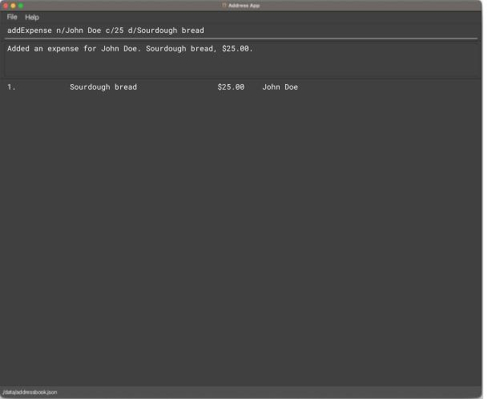
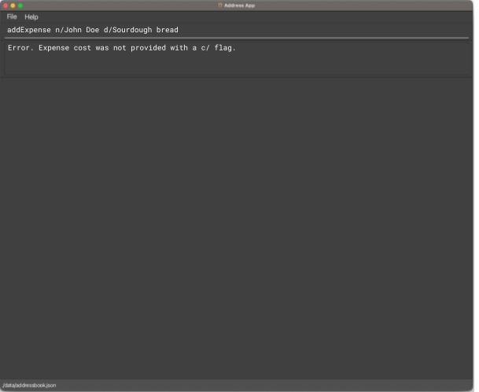
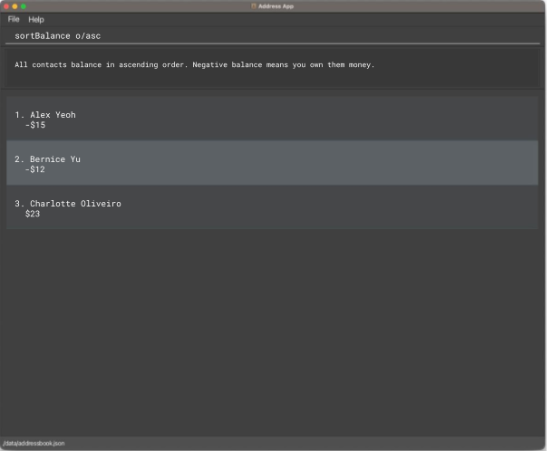
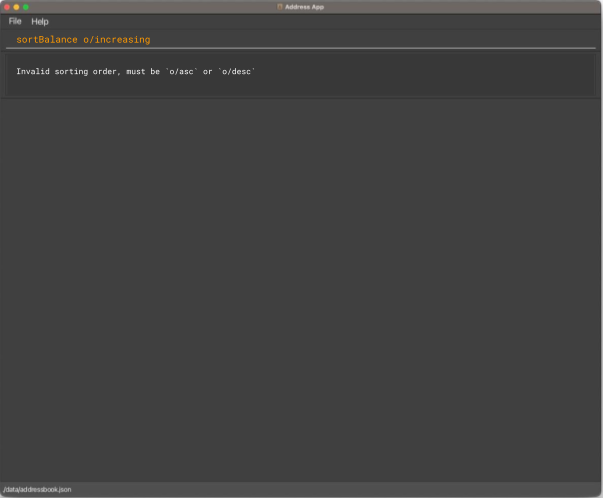
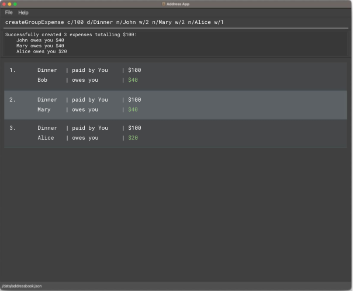
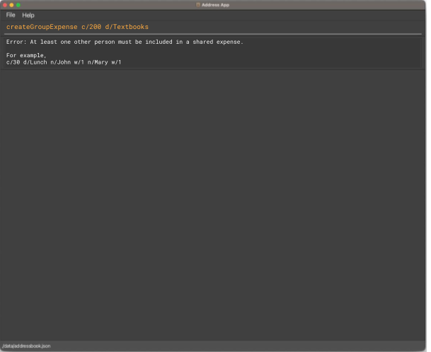

# User Guide

## Welcome to Spend n Split!

***Taking care of your finances has never been easier!***

Spend n Split (SnS) is a **desktop app for managing transactions from contacts, optimized for use via a Command Line
Interface** (CLI) while still having the benefits of a Graphical User Interface (GUI). If you can type fast, SnS can
get your contact transaction management tasks done faster than traditional GUI apps.

---

## Quick Start

1. Ensure you have Java `11` or above installed in your Computer.

2. Download the latest `spendnsplit.jar` from [here](https://github.com). (Coming soon)

3. Copy the file to the folder you want to use as the _home folder_ for your Spend N Split.

4. Open a command terminal, `cd` into the folder you put the jar file in, and use the `java -jar spendnsplit.jar`
   command to run the application.<br>
   A GUI similar to the below should appear in a few seconds. Note how the app contains some sample data.<br>
   

5. Type the command in the command box and press Enter to execute it. e.g. typing **`help`** and pressing Enter will
   open the help window.<br>
   Some example commands you can try:

    * `listPerson` : Lists all persons.

    * `listTransaction` : Lists all transactions.

    * `exit` : Exits the app.

6. Learn more about navigating the app in the [Navigating the App](#navigating-the-app) section below.
6. Learn more about the commands in the [Features](#features) section below.

---

## Navigating the App

Spend n Split has an intuitive Graphical User Interface (GUI) that allows you to navigate the app easily.


| Component                  | Description                                                                                                                |
|----------------------------|----------------------------------------------------------------------------------------------------------------------------|
| **Command Input Field**    | Type commands here and press `Enter` to execute them.                                                                      |
| **Command Output Display** | Shows the result of the command execution.                                                                                 |
| **Transaction List**       | Shows a list of transactions. <br/> The list can be filtered and sorted by the user.                                       |
| **Transaction Card**       | Shows the details of a transaction. <br/> Details include the description, date, payee, as well as the breakdown of costs. |
| **Person List**            | Shows a list of persons. <br/> TheÏ list can be filtered and sorted by the user.                                           |
| **Person Card**            | Shows the details of a person. <br/> Details include name, balance, phone number, etc.                                     |

---

## Features

### __v1.2__

### Adding a transaction: `addTransaction`

Adds a Transaction.
Format: `addTransaction n=NAME c=COST d=DETAILS`

Examples:

* `addTransaction n=John Doe c=25 d=Sourdough bread`
* `addTransaction n=Sir Bobby c=1759 d=Iphone 20`

Sample Execution:

```bash
$ addTransaction n=John Doe c=25 d=Sourdough bread 

Added a transaction for John Doe. Sourdough bread, $25.00.

$ addTransaction n=Ryan d=Sourdough bread 

Error. Transaction cost was not provided with a c= flag.
```





### Editing a Transaction: `editTransaction`

Edits the transaction at the specified `INDEX`. The index refers to the index number when viewing the TransactionList.
The index **must be a positive integer** 1, 2, 3, ...

Transaction details that can be edited:

* Description
* Cost
* Payee

Format: `editTransaction INDEX [d=DESCRIPTION] [c=COST] [n=PAYEE]`

Examples:

* `editTransaction 1 c=12.12`
* `editTransaction 2 d=Potato n=Bob`
* At least one of the optional fields must be provided.
* Existing values will be updated to the input values.
* A transaction cannot be edited to be "irrelevant".

Sample Execution:

``` 
editTransaction 1 n=Bob c=12.12
```


### Updating a Portion of a Transaction: `updatePortion`

Updates the portion of a transaction at the specified `INDEX`. The index refers to the index number when viewing the
TransactionList. The index **must be a positive integer** 1, 2, 3, ...

Portion refers to the amount of money that a person owes you for a transaction. \
The portion is calculated based on the cost of the transaction and the proportion of the transaction that the person has
to pay for, which is determined by the `WEIGHT` of the person.

Format: `updatePortion INDEX n=NAME w=WEIGHT`

Examples:

* To add a new person (e.g. Alice) to the transaction:
    * `updatePortion 1 n=Alice w=0.5`


* To edit the weight of an existing person (e.g. Bob) in the transaction:
    * `updatePortion 1 n=Bob w=0.5`


* To remove an existing person (e.g. Bob) from the transaction, set the weight to 0:
    * `updatePortion 1 n=Bob w=0`

Sample Execution:

```
updatePortion 1 n=Alice w=0.5
```


### Deleting a transaction: `deleteTransaction`

Deletes the specified transaction based on index. Must be in a transaction log view when entering this command.

Format: `deleteTransaction INDEX`

Parameters:

- `INDEX`: The index of the transaction to be deleted.

Examples:

* `deleteTransaction 2`
    * Deletes the second transaction in the list
* `deleteTransaction 1`
    * Deletes the first transaction in the list


### Viewing my log with a person: `log`

Shows a list of the transactions with the specified person.

Format: `log p=PERSON`

Parameters:

- `p=PERSON`: Specifies the name of the person whose log we want to check.

Examples:

* `log p=Bob`
    * Shows log with Bob
* `log p=Alice`
    * Shows log with Alice


### Settling transactions: `settlePerson`

Fully settles the outstanding balance with the specified person.
After settling, outstanding balance with the specified person will be 0.

Format: `settlePerson INDEX`

Example:

*  `settlePerson 1` settles the outstanding balance with the 2nd person in the displayed list.

Sample Execution:

```
$ settlePerson 

Invalid command format! 
settlePerson: Settle any outstanding balance with another person. Parameters: INDEX (must be a positive integer)
Example: settlePerson 1

$ settlePerson 1

Balance settled: Alex Yeoh 
```


### Listing balances of all persons : `list`

Shows the outstanding balances for each person, along with their contact information.

Format: `list`

Sample Execution:

```
$ list

| S/N | Name | Contact  | Balance |
| --- | ---  | -------- | ------- |
|  1  | Amy  | 95382713 |   $50   |
|  2  | John | 82347185 |  -$14   |

```


### Sorting people by balance: `sortBalance`

Sorts the list of people in your address book based on their outstanding balances in either ascending or descending
order. This allows you to quickly identify who owes the most or the least amount of money. Negative balance means you
own them money.

Format: `sortBalance o=ORDER`

Parameters:

- `o=ORDER`: Specifies the order in which to sort the balances. Use `asc` for ascending order and `desc` for
  descending order. Raise error for missing or unknown parameters.

Examples:

* `sortBalance o=asc`
    * This command will rearrange the list to show the person with the lowest outstanding balance at the top, followed
      by others in increasing order of their outstanding balances.
* `sortBalance o=desc`
    * This command will rearrange the list to show the person with the highest outstanding balance at the top,
      followed by others in decreasing order of their outstanding balances.

Sample execution:

```
$ sortBalance o=asc
All contacts balance in ascending order. Negative balance means you own them money.
1. Alex Yeoh, -$15
2. Bernice Yu, -$12
3. Charlotte Oliveiro, $23
```



```
$ sortBalance
Invalid sorting order, must be `o=asc` or `o=desc`

$ sortBalance o=increasing
Invalid sorting order, must be `o=asc` or `o=desc`
```



### Creating shared transactions: `createGroupTransaction`

Creates a transaction for multiple people with customised split ratios.

Format: `createGroupTransaction c=COST d=DETAILS [n=NAME w=WEIGHT]...`

- Cost has to be a number.
- Positive cost means that the person owes you.
- Negative cost means that you owe the person.
- If you want to create a weight for yourself, include `n=Self` to refer to yourself.
- At least one pair of name and weight must be provided.
- Weight must be an integer.
- The cost for each person is calculated as follows:
    - Individual cost = Total Cost * (Individual Weight / Total Weight)

Examples:

* `createGroupTransaction c=100 d=Dinner n=John w=2 n=Mary w=2 n=Alice w=1`
    * creates 3 transactions: two transactions of $40 for John and Mary (2/5 of $100 each), and one transaction of $20
      for
      Alice (1/5 of $100)
* `createGroupTransaction c=600 d=Rent n=Self w=1 n=John w=1 n=Mary =w1`
    * creates 2 transactions: $200 each for John and Mary (since you incurred 1/3 of the cost, which is $200)

Sample execution:

```
$ createGroupTransaction c=100 d=Dinner n=John w=2 n=Mary w=2 n=Alice w=1

Successfully created 3 transactions totalling $100:    
    John owes you $40
    Mary owes you $40
    Alice owes you $20
```



```
$ createGroupTransaction c=200 d=Textbooks

Error: At least one other person must be included in a shared transaction.

For example,
c=30 d=Lunch n=John w=1 n=Mary w=1
```



### __v1.1__

### Adding a person: `addPerson`

Adds a person to the address book.

Format: `addPerson n=NAME p=PHONE_NUMBER e=EMAIL a=ADDRESS [t=TAG]…​`

Examples:

* `addPerson  n=John Doe p=98765432 e=johnd@example.com a=John street, block 123, #01-01`
* `addPerson  n=Betsy Crowe t=friend e=betsycrowe@example.com a=Newgate Prison p=1234567 t=criminal`

### Listing all persons : `list` (deprecated)

**NOTE: The latest version of this command is in v1.2**
Shows a list of all persons in the address book.

Format: `list`

### Editing a person : `editPerson`

Edits an existing person in the address book.

Format: `editPerson INDEX [n=NAME] [p=PHONE] [e=EMAIL] [a=ADDRESS] [t=TAG]…​`

* Edits the person at the specified `INDEX`. The index refers to the index number shown in the displayed person list.
  The index **must be a positive integer** 1, 2, 3, …​
* At least one of the optional fields must be provided.
* Existing values will be updated to the input values.
* When editing tags, the existing tags of the person will be removed i.e adding of tags is not cumulative.
* You can remove all the person’s tags by typing `t=` without
  specifying any tags after it.

Examples:

* `editPerson 1 p=91234567 e=johndoe@example.com`
    * Edits the phone number and email address of the 1st person to be `91234567` and `johndoe@example.com`
      respectively.
* `editPerson 2 n=Betsy Crower t=`
    * Edits the name of the 2nd person to be `Betsy Crower` and clears all existing tags.

  

### Locating persons by name: `find`

Finds persons whose names contain any of the given keywords.

Format: `find KEYWORD [MORE_KEYWORDS]`

* The search is case-insensitive. e.g `hans` will match `Hans`
* The order of the keywords does not matter. e.g. `Hans Bo` will match `Bo Hans`
* Only the name is searched.
* Only full words will be matched e.g. `Han` will not match `Hans`
* Persons matching at least one keyword will be returned (i.e. `OR` search).
  e.g. `Hans Bo` will return `Hans Gruber`, `Bo Yang`

Examples:

* `find John` returns `john` and `John Doe`
* `find alex david` returns `Alex Yeoh`, `David Li`
  

### Deleting a person : `deletePerson`

Deletes the specified person from the address book.

Format: `deletePerson INDEX`

* Deletes the person at the specified `INDEX`.
* The index refers to the index number shown in the displayed person list.
* The index **must be a positive integer** 1, 2, 3, …​

Examples:

* `list` followed by `deletePerson 2` deletes the 2nd person in the address book.
* `find Betsy` followed by `deletePerson 1` deletes the 1st person in the results of the `find` command.


### Clearing all entries : `clear`

Clears all entries from the address book.

Format: `clear`


### Exiting the program : `exit`

Exits the program.

Format: `exit`

### Saving the data

AddressBook data are saved in the hard disk automatically after any command that changes the data. There is no need
to save manually.

### Editing the data file

AddressBook data are saved automatically as a JSON file `[JAR file location]/data/addressbook.json`. Advanced users
are welcome to update data directly by editing that data file.

## FAQ

### Why do the portions in the log not add up exactly to the balance?

The portions displayed are rounded to a fixed number of decimal places. This means there may be fractional differences
between the actual portions and what is displayed.

Example:

```
If these are the logs stored:
A:      0.122
B:      0.223
Total:  0.345

This is displayed instead when the app is set to show 2 decimal places:
A:      0.12
B:      0.22
Total:  0.35
```
