# User Guide
## Description
Spend n Split (SnS) is a **desktop app for managing transactions from contacts, optimized for use via a Command Line 
Interface** (CLI) while still having the benefits of a Graphical User Interface (GUI). If you can type fast, SnS can 
get your contact transaction management tasks done faster than traditional GUI apps.

## Setup

1. Ensure you have Java `11` or above installed in your Computer.

2. Download the latest `spendnsplit.jar` from [here](https://github.com). (Coming soon)

3. Copy the file to the folder you want to use as the _home folder_ for your Spend N Split.

4. Open a command terminal, `cd` into the folder you put the jar file in, and use the `java -jar spendnsplit.jar` 
command to run the application.<br>
   A GUI similar to the below should appear in a few seconds. Note how the app contains some sample data.<br>
   

5. Type the command in the command box and press Enter to execute it. e.g. typing **`help`** and pressing Enter will 
open the help window.<br>
   Some example commands you can try:

    * `list` : Lists all transactions.

    * `clear` : Deletes all content.

    * `exit` : Exits the app.

6. Refer to the [Features](#features) below for details of each command.

## Features

### __v1.2__

### Adding a transaction: `addTransaction`
Adds a Transaction.
`addTransaction`
Creates a transaction for multiple people with customised split ratios.

Format: `addTransaction d=DETAILS n=NAME c=COST [ts=TIME] [n=NAME w=WEIGHT]...`
- Cost and weights have to be decimal numbers or fractions, and they must be positive.
- The first name refers to the payee (that is the person whom everyone else now owes).
- If the timestamp is not provided, the default time is the current system time.
- If you want to create a weight for yourself, include `n=Self` to refer to yourself.
- At least one pair of name and weight must be provided.
- The cost for each person is calculated as follows:
    - Individual cost = Total Cost * (Individual Weight / Total Weight)

Examples:
* `addTransaction d=Dinner n=Self c=100 n=John w=2 n=Mary w=2 n=Alice w=1`
    * Dinner costed $100 was first paid by self; now John and Mary each owe self $40 (2/5 of $100 each), Alice owes self $20 (1/5 of $100)
* `addTransaction d=Rent n=John c=600 ts=2020-10-10T12:00 n=Self w=1 n=John w=1 n=Mary =w1`
    * Rent costed $600 and was first paid by John at 12 o'clock on 10 October 2020; now self owes John $200 (1/3 of $600)

Sample execution:
```
$ addTransaction d=Dinner n=self c=100 n=John w=2 n=Mary w=2 n=Alice w=1

```


```
$ addTransaction c=200 d=Textbooks

Invalid command format! 
addTransaction: Adds a transaction to the address book. 
Parameters: d=DESCRIPTION n=NAME c=COST [n=NAME w=WEIGHT] Example: addTransaction d=bread n=John Doe c=25.00 n=Self w=1.5 n=John Doe w=1
```


### Editing a Transaction: `editTransaction`
Edits the transaction for the person at the specified `INDEX`. The index refers to the index number when viewing a 
specific person's transactions. The index **must be a positive integer** 1, 2, 3, …​
Format: `editTransaction n=NAME INDEX [c=COST] [d=DETAILS]​`

Examples:
* `editTransaction n=John Doe 1 c=35`
* `editTransaction n=Sir Bobby 4 d=iPhone 30`
* At least one of the optional fields must be provided.
* Existing values will be updated to the input values.

Sample Execution:
```
Suppose this is the list of transactions for Bob:

$ log n=Bob

1.            eat                  $1.00    Bob
2.            Pokemon Cards        $15.12   Bob

$ editTransaction n=Bob 2 c=12.12

I have edited Bob's transaction to be Pokemon Cards, $12.12.

$ editTransaction n=Bob 3 d=Potato

Error! There is no such transaction for Bob at that index.
```
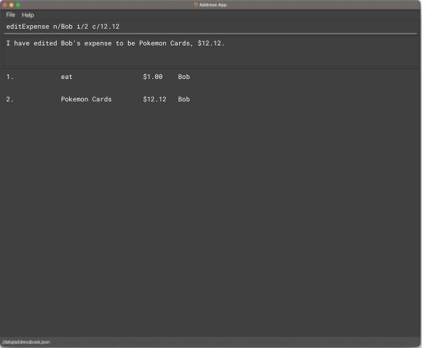


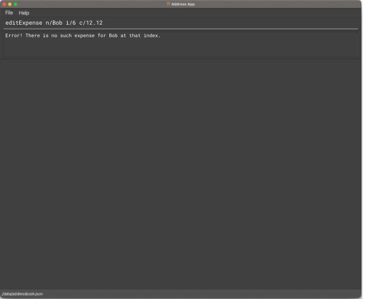


### Deleting a transaction: `deleteTransaction`

Deletes the specified transaction based on index. Must be in a transaction log view when entering this command.

Format: `deleteTransaction INDEX`

Parameters:
- `INDEX`: The index of the transaction to be deleted.

Examples:

* `deleteTransaction 2`
    * Deletes the second transaction in the list
* `deleteTransaction 1`
    * Deletes the first transaction in the list


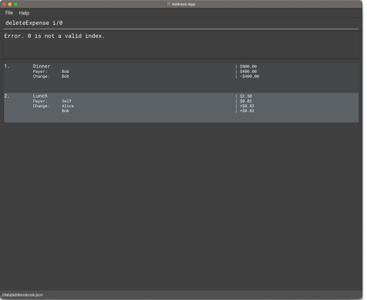

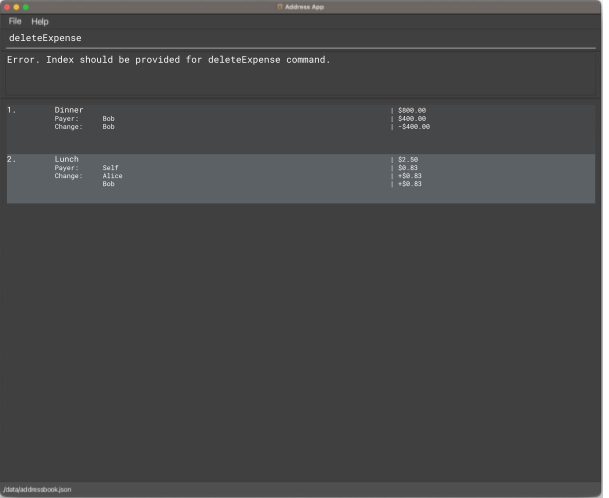

### Viewing my log with a person: `log`

Shows a list of the transactions with the specified person.

Format: `log p=PERSON`

Parameters:
- `p=PERSON`: Specifies the name of the person whose log we want to check.

Examples:

* `log p=Bob`
    * Shows log with Bob
* `log p=Alice`
    * Shows log with Alice

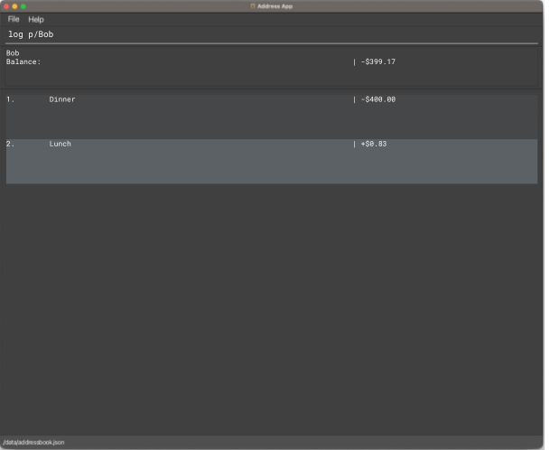

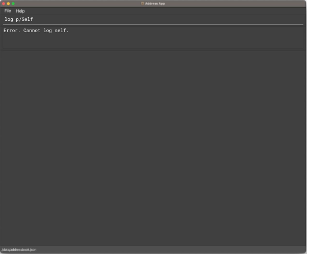

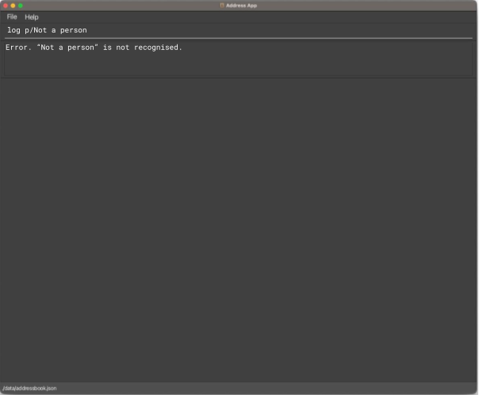

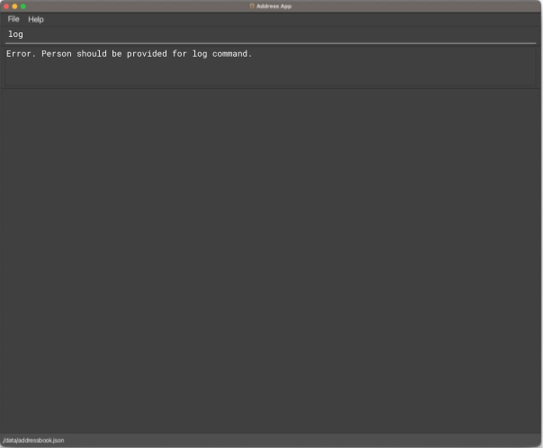


### Settling transactions: `settle`
Fully settles the outstanding balance with the specified person.
After settling, outstanding balance with the specified person will be 0.

Format: `settle n=NAME`

Example:
- `settle n=Bob`
    - settles the outstanding balance with contact Bob.

Sample Execution:
```
$ settle 

Error: Please indicate the person you would like to settle transactions with.

$ settle n=Bob

Confirm settle transaction with Bob? [Y/N]
    Bob owes you $50. 
    
$ Y

Successfully settled transaction with Bob.  
    No outstanding balance with Bob.

$ settle n=Mary

Confirm settle transaction with Mary? [Y/N]
    You owe Mary $30.

$ N
```

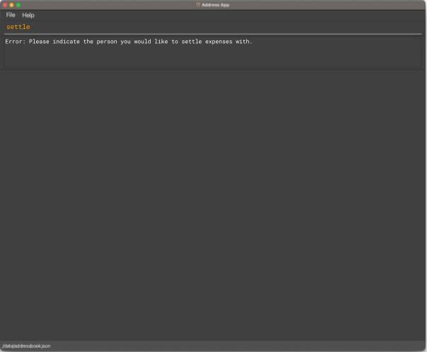

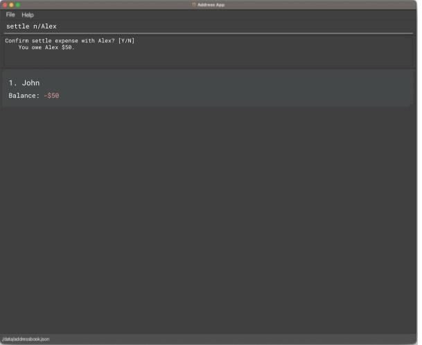

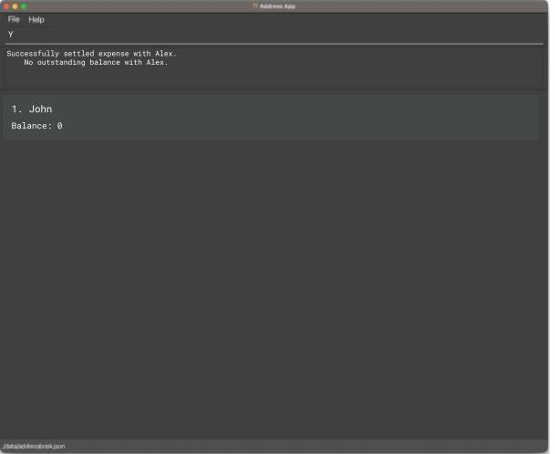


### Listing balances of all persons : `list`


Shows the outstanding balances for each person, along with their contact information.

Format: `list`

Sample Execution:

```
$ list

| S/N | Name | Contact  | Balance |
| --- | ---  | -------- | ------- |
|  1  | Amy  | 95382713 |   $50   |
|  2  | John | 82347185 |  -$14   |

```
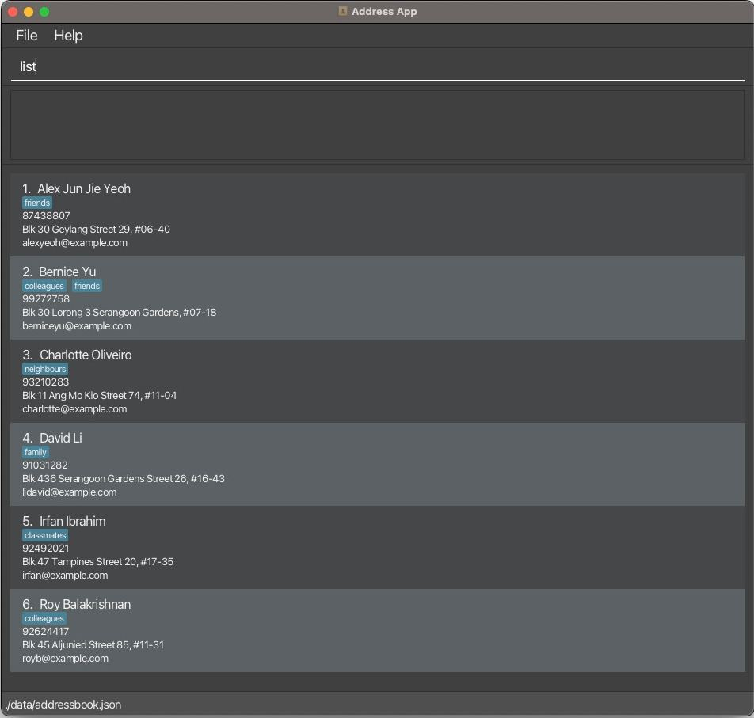


### Sorting people by balance: `sortPerson`

Sorts the list of people in your address book based on their outstanding balances in either ascending or descending 
order. This allows you to quickly identify who owes the most or the least amount of money. Negative balance means you 
own them money.

Format: `sortBalance ORDER`

Parameters:
- `ORDER`: Specifies the order in which to sort the balances. Use `-` for ascending order (or most negative balance at the top) and `+` for descending order (or most positive balance at the top). Raise error for missing or unknown parameters.

Examples:
* `sortPerson -`
    * This command will rearrange the list to show the person with the lowest outstanding balance at the top, followed 
        by others in increasing order of their outstanding balances.
* `sortPerson +`
    * This command will rearrange the list to show the person with the highest outstanding balance at the top, 
        followed by others in decreasing order of their outstanding balances.

Sample execution:

```
$ sortPerson +
All contacts balance in descending order. Negative balance means you own them money.
1. John, +40.00
2. Mary, +40.00
3. Alice, +20.00
```


### __v1.1__
### Adding a person: `add`

Adds a person to the address book.

Format: `add n=NAME p=PHONE_NUMBER e=EMAIL a=ADDRESS [t=TAG]…​`

Examples:
* `add n=John Doe p=98765432 e=johnd@example.com a=John street, block 123, #01-01`
* `add n=Betsy Crowe t=friend e=betsycrowe@example.com a=Newgate Prison p=1234567 t=criminal`

### Listing all persons : `list` (deprecated)
**NOTE: The latest version of this command is in v1.2**
Shows a list of all persons in the address book.

Format: `list`


### Editing a person : `edit`

Edits an existing person in the address book.

Format: `edit INDEX [n=NAME] [p=PHONE] [e=EMAIL] [a=ADDRESS] [t=TAG]…​`

* Edits the person at the specified `INDEX`. The index refers to the index number shown in the displayed person list. 
    The index **must be a positive integer** 1, 2, 3, …​
* At least one of the optional fields must be provided.
* Existing values will be updated to the input values.
* When editing tags, the existing tags of the person will be removed i.e adding of tags is not cumulative.
* You can remove all the person’s tags by typing `t=` without
  specifying any tags after it.

Examples:
*  `edit 1 p=91234567 e=johndoe@example.com`
    *  Edits the phone number and email address of the 1st person to be `91234567` and `johndoe@example.com` 
        respectively.
*  `edit 2 n=Betsy Crower t=`
    *  Edits the name of the 2nd person to be `Betsy Crower` and clears all existing tags.

### Locating persons by name: `find`

Finds persons whose names contain any of the given keywords.

Format: `find KEYWORD [MORE_KEYWORDS]`

* The search is case-insensitive. e.g `hans` will match `Hans`
* The order of the keywords does not matter. e.g. `Hans Bo` will match `Bo Hans`
* Only the name is searched.
* Only full words will be matched e.g. `Han` will not match `Hans`
* Persons matching at least one keyword will be returned (i.e. `OR` search).
  e.g. `Hans Bo` will return `Hans Gruber`, `Bo Yang`

Examples:
* `find John` returns `john` and `John Doe`
* `find alex david` returns `Alex Yeoh`, `David Li`
  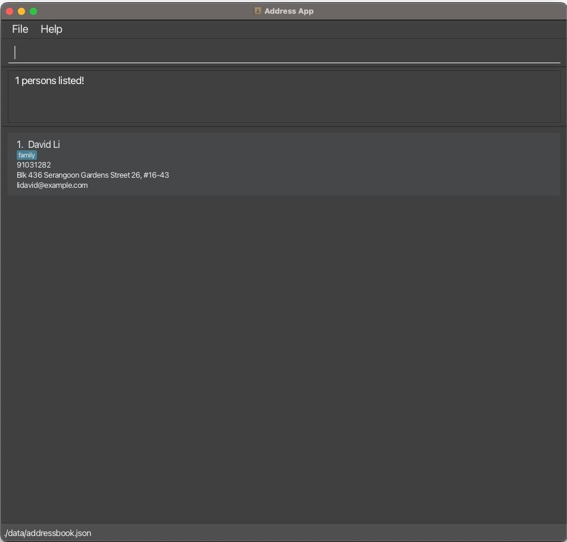


### Deleting a person : `delete`

Deletes the specified person from the address book.

Format: `delete INDEX`

* Deletes the person at the specified `INDEX`.
* The index refers to the index number shown in the displayed person list.
* The index **must be a positive integer** 1, 2, 3, …​

Examples:
* `list` followed by `delete 2` deletes the 2nd person in the address book.
* `find Betsy` followed by `delete 1` deletes the 1st person in the results of the `find` command.

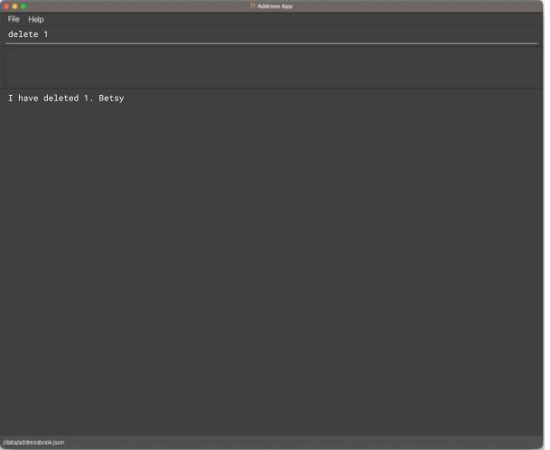


### Clearing all entries : `clear`

Clears all entries from the address book.

Format: `clear`
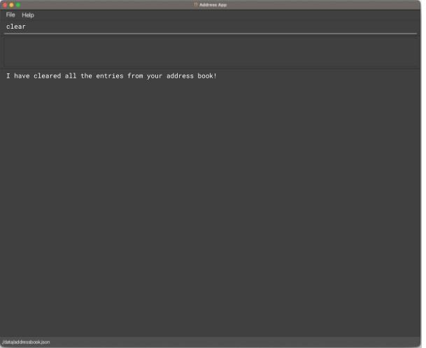


### Exiting the program : `exit`

Exits the program.

Format: `exit`
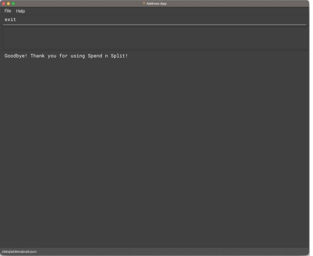

### Saving the data

AddressBook data are saved in the hard disk automatically after any command that changes the data. There is no need 
to save manually.

### Editing the data file

AddressBook data are saved automatically as a JSON file `[JAR file location]/data/addressbook.json`. Advanced users 
are welcome to update data directly by editing that data file.
## FAQ
### Why do the portions in the log not add up exactly to the balance?
The portions displayed are rounded to a fixed number of decimal places. This means there may be fractional differences 
between the actual portions and what is displayed.

Example:
```
If these are the logs stored:
A:      0.122
B:      0.223
Total:  0.345

This is displayed instead when the app is set to show 2 decimal places:
A:      0.12
B:      0.22
Total:  0.35
```
