***Taking care of your finances has never been easier!***

Spend n Split (SnS) is an application for managing transactions from your contacts list. Built for university students that reside on campus, it utilises your fast typing skills to help you maintain financial accountability between yourself and your peers. All you need to do, is to record your transactions in Spend n Split. Filtering, sorting, as well as the calculations of balances owed will be automatically handled by Spend n Split.

* Table of Contents
{:toc}

--------------------------------------------------------------------------------------------------------------------

## Glossary

### Person

Persons are the people with whom you track your balances against. To create a transaction with a person, they must first have been added to the app.

A person has the following attributes:
- Name
- Balance (calculated by the app)
- Tag(s)
- Phone number
- Telegram handle
- Email Address
- Address

Persons are uniquely identified by their names. No two persons can have the same name and names are case-insensitive.

Having a positive balance against a person means that they owe you money, conversely having a negative balance against a person means that you owe them money.

### Transaction

Transactions are events in which money is exchanged.

A transaction has the following attributes:
- Description
- Payee
- Amount
- Timestamp
- Portion(s)

Note: There are 2 special names when adding transactions - "Self" and "Others". "Self" refers to you, the user, and others refers to anyone not in the app.

After a transaction, each payer in the list of portions owes the payee a fraction of the amount, based on their weights in the list of portions.

#### Relevant Transactions

A transaction is only considered **relevant** if it involves you owing or being owed money
by someone from your contacts list. In a relevant transaction:
1. "Self" must be either the payee, a payer, or both: you must be involved in the transaction.
2. Include at least one person stored in the app (not "Self" or "Others") as either
the payee, a payer, or both: someone else in your contacts list must be involved in the transaction.

If these conditions are not met, it means that the transaction does not affect your balance
with anyone on your contract list, and hence is considered **irrelevant**.

Examples of relevant transactions:
- You are the payee for dinner. The payers are you, Alice and Bob.
- Bob pays for transport. You and Alice are riders, and hence are the payers.

In both these cases, you were involved as the payee or payer of the transaction,
and so was another person in your contacts.

Examples of irrelevant transactions:
- Bob was the payee for dinner. The payers are Alice and Bob. You are not involved
and hence, this transaction is irrelevant.
- You pay for transport for Zack. Zack is the only payer. Zack was then deleted
contacts list afterwards, resulting in him being considered as "Others" in the transaction.
This transaction becomes irrelevant and is automatically deleted from the transactions
list when Zack is deleted.

Note:
- If you delete payers such that no one else from your contacts are involved in the
transaction, **SnS will block this**. You are advised to delete the transaction if
it no longer concerns you or anyone from your contacts list.
- If you delete a person, some transactions may be considered irrelevant as highlighted
in the second example of an irrelevant transaction. **SnS will automatically delete
these irrelevant transactions**.

### Fields

Inputs to fields should not contain the "=" sign.

The following fields are used for commands:

| Field | Prefix | Format | Example |
| --- | --- | --- | --- |
| Index | - | Positive integers only | `1`, `2`, `3` |
| Keyword | - | No `=` sign allowed | `Bob`, `Lunch` |
| Name | n | Alphanumeric, can contain multiple words | `Bob`, `Alex Yeoh` |
| Phone number | p | Numeric, minimum length of 3 digits | `99999999`, `88888888` |
| Telegram handle | tg | Starts with @, followed by a minimum of 5 alphanumeric characters or underscores | `@nus_cs2103` , `@spend_n_split` |
| Email address | e | Valid email format required | `damithch@comp.nus.edu.sg`, `dcsdcr@nus.edu.sg` |
| Address | a | No `=` sign allowed | `Kent Ridge Hall`, `RC4` |
| Tag | t | Single-word, alphanumeric | `friend`, `colleague` |
| Description | d | No `=` sign allowed | `Lunch`, `Dinner @ UTown` |
| Amount/ Cost | c | Positive rational numbers; can be a decimal or a fraction; spaces allowed | `12`, `.5`, `0.5/3`, `1.25 / 1.56`, `12 000 000` |
| Timestamp | ts | Dates in DD/MM/YYYY format, time in HH:SS format; provide date, time, or both; if both, date must come first, separated by a space | `12:12`, `31/12/2020`, `28/02/2021 00:00` |
| Weight | w | Positive rational numbers; can be a decimal or a fraction; spaces allowed | `12`, `.5`, `0.5/3`, `1.25 / 1.56`, `12 000 000` |
| Original command | o | Use one of the original command keywords listed in this user guide | `setShorthand`, `addTransaction` |
| Shorthand | s | Single-word, English alphabet characters only | `s`, `aT` |

--------------------------------------------------------------------------------------------------------------------

## Quick Start

1. Ensure you have Java `11` or above installed in your Computer.

2. Download the latest `spendnsplit.jar` from [here](https://github.com). (Coming soon)

3. Copy the file to the folder you want to use as the _home folder_ for your Spend N Split.

4. Open a command terminal, `cd` into the folder you put the jar file in, and use the `java -jar spendnsplit.jar`
   command to run the application.<br>
   A GUI similar to the below should appear in a few seconds. Note how the app contains some sample data.<br>
   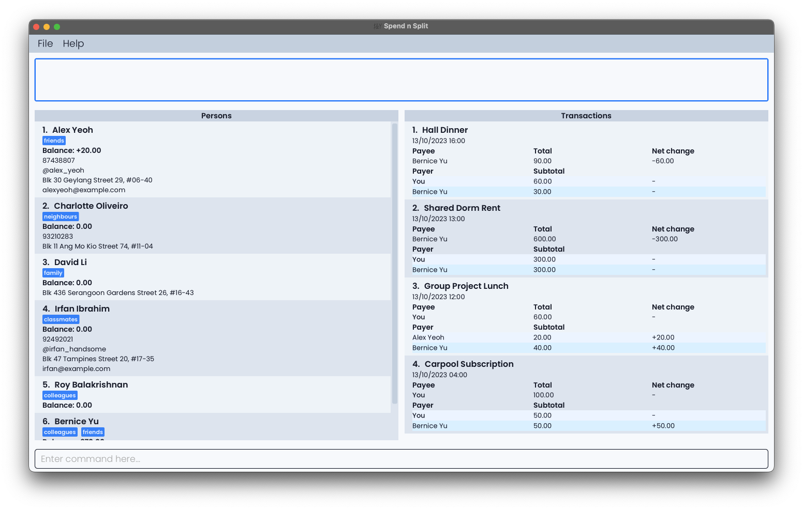

5. Type the command in the command box and press Enter to execute it. e.g. typing **`help`** and pressing Enter will
   open the help window.<br>
   Some example commands you can try:

    * `listPerson` : Lists all persons.

    * `listTransaction` : Lists all transactions.

    * `exit` : Exits the app.

6. Learn more about navigating the app in the [Navigating the App](#navigating-the-app) section below.
7. Learn more about the commands in the [Features](#features) section below.

--------------------------------------------------------------------------------------------------------------------

## Navigating the App

Spend n Split has an intuitive Graphical User Interface (GUI) that allows you to navigate the app easily.

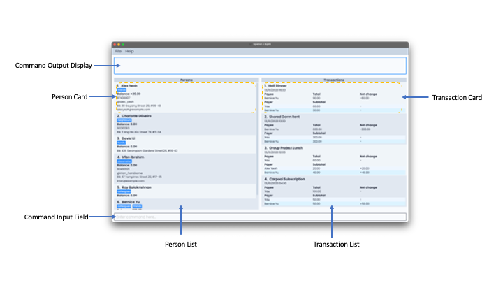

| Component                  | Description                                                                                                                |
|----------------------------|----------------------------------------------------------------------------------------------------------------------------|
| **Command Input Field**    | Type commands here and press `Enter` to execute them.                                                                      |
| **Command Output Display** | Shows the result of the command execution.                                                                                 |
| **Transaction List**       | Shows a list of transactions. <br/> The list can be filtered and sorted by the user.                                       |
| **Transaction Card**       | Shows the details of a transaction. <br/> Details include the description, date, payee, as well as the breakdown of costs. |
| **Person List**            | Shows a list of persons. <br/> The list can be filtered and sorted by the user.                                            |
| **Person Card**            | Shows the details of a person. <br/> Details include name, balance, phone number, etc.                                     |

--------------------------------------------------------------------------------------------------------------------

## Features

<div markdown="block" class="alert alert-info">

**:information_source: Notes about the command format:**<br>

- Words in `UPPER_CASE` are the parameters to be supplied by the user.<br>
  e.g. in `addPerson n=NAME`, `NAME` is a parameter which can be used as `addPerson n=John Doe`.

- Items in square brackets are optional.<br>
  e.g `n=NAME [t=TAG]` can be used as `n=John Doe t=friend` or as `n=John Doe`.

- Items with `…`​ after them can be used multiple times including zero times.<br>
  e.g. `[t=TAG]…​` can be used as ` ` (i.e. 0 times), `t=friend`, `t=friend t=family` etc.

- Parameters can be in any order.<br>
  e.g. if the command specifies `n=NAME p=PHONE_NUMBER`, `p=PHONE_NUMBER n=NAME` is also acceptable.

- Extraneous parameters for commands that do not take in parameters (such as `listPerson`, `listTransaction`, `help`, `clear`, `exit`) will be ignored.<br>
  e.g. if the command specifies `help 123`, it will be interpreted as `help`.

- Commands are case-sensitive. `addPerson` is a valid command, while `ADDPERSON` or `addperson` are not.

- If you are using a PDF version of this document, be careful when copying and pasting commands that span multiple lines as space characters surrounding line-breaks may be omitted when copied over to the application.

</div>

### Person-related features

#### Adding a person: `addPerson`

Adds a person to the spendnsplit book.

Format: `addPerson n=NAME [p=PHONE_NUMBER] [tg=TELEGRAM_HANDLE] [e=EMAIL] [a=ADDRESS] [t=TAG]…​`

The order of the fields is flexible (e.g. phone number can come before name) but the command word (addPerson) must be in front.

Examples:

* `addPerson  n=John Doe p=98765432 e=johnd@example.com a=John street, block 123, #01-01`
* `addPerson  n=Betsy Crowe t=friend e=betsycrowe@example.com a=London Block 55 p=1234567 t=London`

Note: Contact details are optional to add. They can also be added later using the editPerson command. However, once they are added, they cannot be removed through the app.

#### Editing a person : `editPerson`

Edits an existing person in the spendnsplit book.

Format: `editPerson INDEX [n=NAME] [p=PHONE] [tg=TELEGRAM_HANDLE] [e=EMAIL] [a=ADDRESS] [t=TAG]…​`

The order of the flagged fields (i.e. those with the = sign) is flexible (e.g. phone number can come before name) but the command word (editPerson) and the index must be in front.

* Edits the person at the specified `INDEX`. The index refers to the index number shown in the displayed person list.
  The index **must be a positive integer** 1, 2, 3, …​
* At least one of the optional fields must be provided.
* Existing values will be updated to the input values.
* When editing tags, the existing tags of the person will be removed i.e adding of tags is not cumulative.
* You can remove all the person’s tags by typing `t=` without
  specifying any tags after it.

Examples:

* `editPerson 1 p=91234567 e=johndoe@example.com`
    * Edits the phone number and email address of the 1st person to be `91234567` and `johndoe@example.com`
      respectively.
* `editPerson 2 n=Betsy Crower t=`
    * Edits the name of the 2nd person to be `Betsy Crower` and clears all existing tags.

  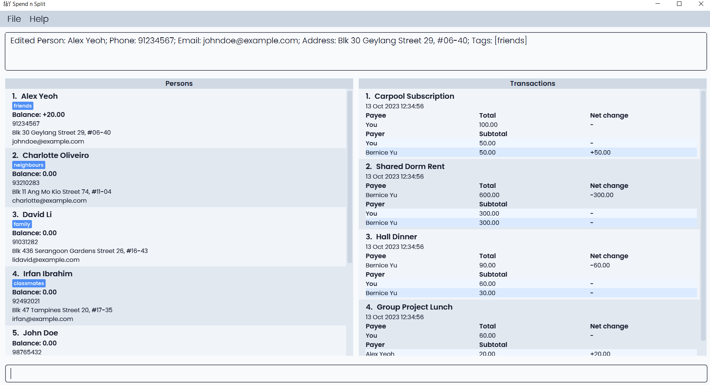

#### Deleting a person : `deletePerson`

Deletes the specified person from the spendnsplit book.

Format: `deletePerson INDEX`

* Deletes the person at the specified `INDEX`.
* The index refers to the index number shown in the displayed person list.
* The index **must be a positive integer** 1, 2, 3, …​
* Transactions involving the deleted person will have the deleted person's name changed to "Others". In the event that
 this results in the transaction becoming irrelevant, the transaction will be automatically deleted. All transactions involving
 the deleted person as a payee will also be automatically deleted.

Examples:

* `list` followed by `deletePerson 2` deletes the 2nd person in the spendnsplit book.
* `find Betsy` followed by `deletePerson 1` deletes the 1st person in the results of the `find` command.

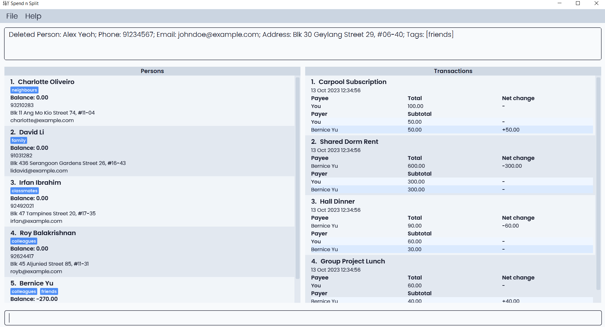

#### Locating persons by name: `listPerson`

Finds persons whose names contain any of the given keywords. If no keywords are entered, lists all persons.

Format: `listPerson [KEYWORD]...`

* The search is case-insensitive. e.g `hans` will match `Hans`
* The order of the keywords does not matter. e.g. `Hans Bo` will match `Bo Hans`
* Only the name is searched.
* Only full words will be matched e.g. `Han` will not match `Hans`
* Persons matching at least one keyword will be returned (i.e. `OR` search).
  e.g. `Hans Bo` will return `Hans Gruber`, `Bo Yang`

Examples:

* `listPerson John` returns `john` and `John Doe`
* `listPerson alex david` returns `Alex Yeoh`, `David Li`
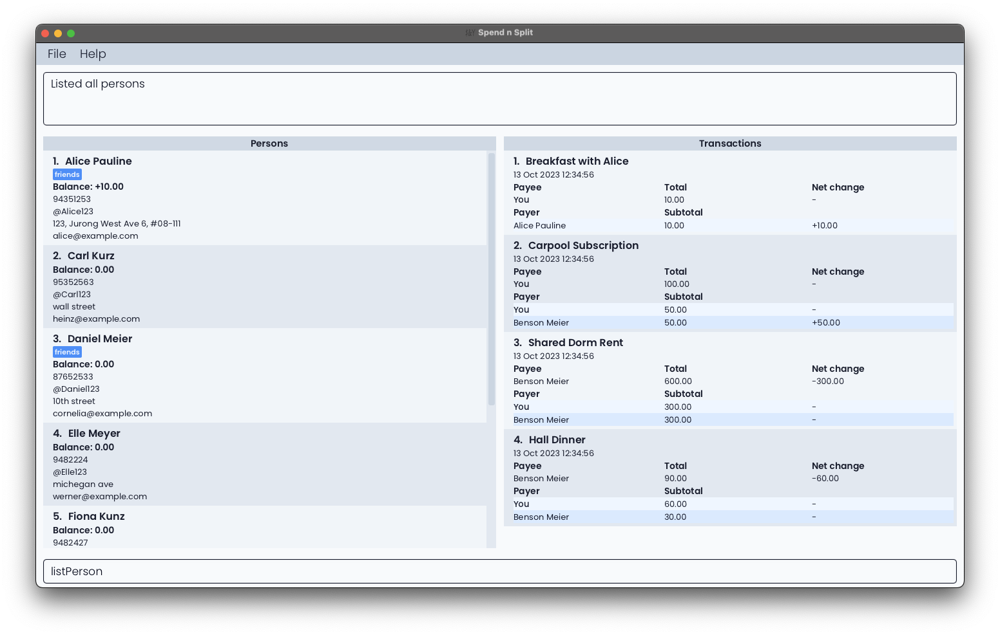


#### Sorting people by balance: `sortPerson`

Sorts the list of people in your spendnsplit book based on their outstanding balances in either ascending or descending
order. This allows you to quickly identify who owes the most or the least amount of money. Negative balance means you
own them money.

Format: `sortPerson ORDER`

Parameters:
- `ORDER`: Specifies the order in which to sort the balances. Use `-` for ascending order (or most negative balance at the top) and `+` for descending order (or most positive balance at the top). Raise error for missing or unknown parameters.

Examples:
* `sortPerson -`
    * This command will rearrange the list to show the person with the lowest outstanding balance at the top, followed
        by others in increasing order of their outstanding balances.
* `sortPerson +`
    * This command will rearrange the list to show the person with the highest outstanding balance at the top,
        followed by others in decreasing order of their outstanding balances.


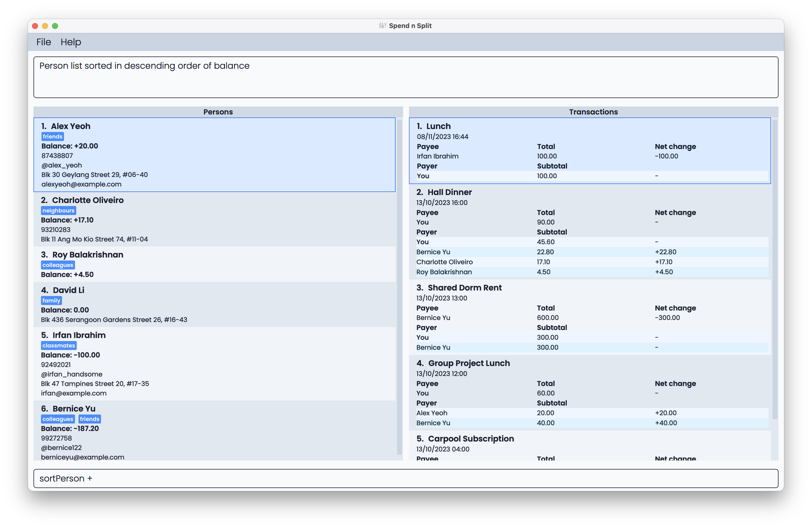
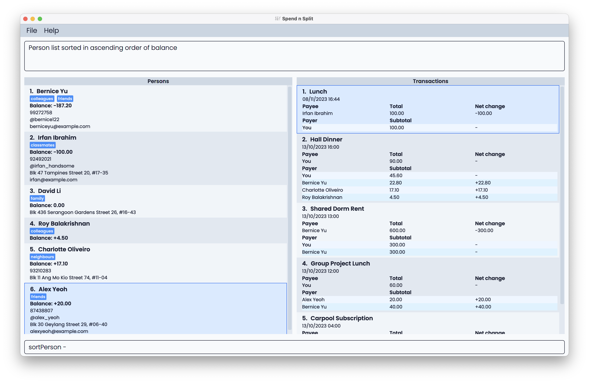

### Transaction-related features

#### Adding a transaction: `addTransaction`

Adds a Transaction.
`addTransaction`
Creates a transaction for multiple people with customised split ratios.

Format: `addTransaction d=DETAILS n=NAME c=COST [ts=TIME] [n=NAME w=WEIGHT]...`
- Cost and weights have to be decimal numbers or fractions, and they must be positive.
- The first name refers to the payee (that is the person whom everyone else now owes).
- If the timestamp is not provided, the default time is the current system time.
- If only the date is given, the default time is set as 00:00.
- If you want to create a weight for yourself, include `n=Self` to refer to yourself.
- At least one pair of name and weight must be provided.
- Payer names should not repeat; however, you are allowed to key in multiple portions for "Others" - the final weight for "Others" will be the sum of all the weights of the "Others" portions keyed in.
- The cost for each person is calculated as follows:
    - Individual cost = Total Cost * (Individual Weight / Total Weight)

The order of the fields is NOT flexible.

<div markdown="block" class="alert alert-info">

**:information_source: Note:**<br>

Transactions added to Spend N Split must be relevant. Refer to the [Relevant Transactions](#relevant-transactions) section for more details.

</div>

Examples:
* `addTransaction d=Dinner n=Self c=100 n=John w=2 n=Mary w=2 n=Alice w=1`
    * Dinner costed $100 was first paid by self; now John and Mary each owe self $40 (2/5 of $100 each), Alice owes self $20 (1/5 of $100)
* `addTransaction d=Rent n=John c=600 ts=2020-10-10T12:00 n=Self w=1 n=John w=1 n=Mary w=1`
    * Rent costed $600 and was first paid by John at 12 o'clock on 10 October 2020; now self owes John $200 (1/3 of $600)

Sample execution:
```
$ addTransaction d=Dinner n=self c=100 n=John w=2 n=Mary w=2 n=Alice w=1

```
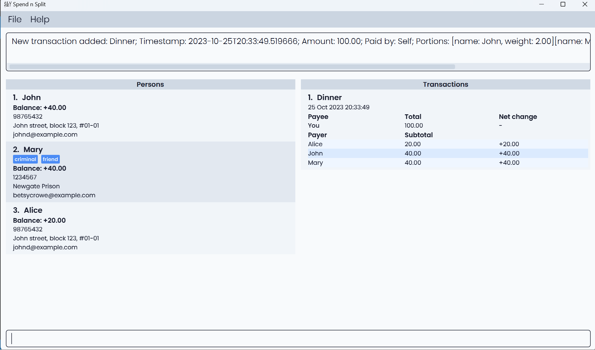


```
$ addTransaction c=200 d=Textbooks


Invalid command format!
addTransaction: Adds a transaction to the spendnsplit book.
Parameters: d=DESCRIPTION n=NAME c=COST [n=NAME w=WEIGHT] Example: addTransaction d=bread n=John Doe c=25.00 n=Self w=1.5 n=John Doe w=1
```

#### Editing a Transaction: `editTransaction`

Edits the transaction at the specified `INDEX`.

Transaction details that can be edited:

* Description
* Cost
* Payee

Format: `editTransaction INDEX [d=DESCRIPTION] [c=COST] [n=PAYEE] [ts=TIME]`

The order of the flagged fields (i.e. those with the = sign) is flexible (e.g. cost can come before details) but the command word (editTransaction) and the index must be in front.

* Edits the transaction at the specified `INDEX`. The index refers to the index number shown in the displayed transaction list.
  The index **must be a positive integer** 1, 2, 3, …
* At least one of the optional fields must be provided.
* Existing values will be updated to the input values.
* If no timestamp is given, the default timestamp is the current system time.
* If only the date is given, the default time is set as 00:00.

<div markdown="block" class="alert alert-info">

**:information_source: Note:**<br>

After editing, the transaction must be relevant. Refer to the [Relevant Transactions](#relevant-transactions) section for more details.

</div>


Examples:

* `editTransaction 1 c=12.12`
* `editTransaction 2 d=Potato n=Bob`
* At least one of the optional fields must be provided.
* Existing values will be updated to the input values.
* A transaction cannot be edited to be "irrelevant".

Sample Execution:

```
editTransaction 1 n=Bob c=12.12
```

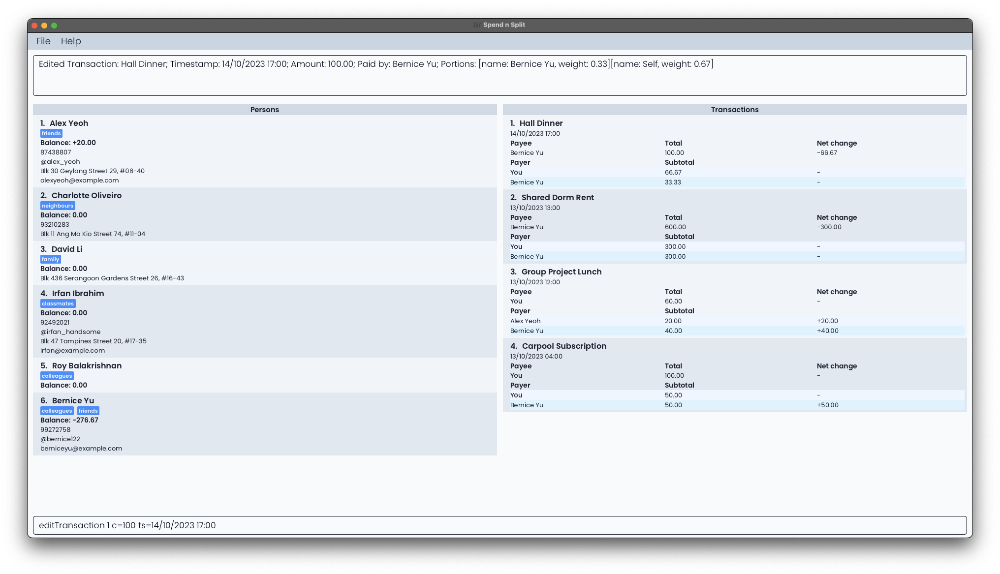

#### Updating a Portion of a Transaction: `updatePortion`

Updates the portion of a transaction at the specified `INDEX`. The index refers to the index number when viewing the
TransactionList. The index **must be a positive integer** 1, 2, 3, ...

Portion refers to the amount of money that a person owes you for a transaction. \
The portion is calculated based on the cost of the transaction and the proportion of the transaction that the person has
to pay for, which is determined by the `WEIGHT` of the person. Hence the `WEIGHT` must be between 0 (inclusive) and 1 (exclusive).

Format: `updatePortion INDEX n=NAME w=WEIGHT`

The order of the flagged fields (i.e. those with the = sign) is flexible (e.g. weight can come before name) but the command word (editTransaction) and the index must be in front.

Examples:

* To add a new person (e.g. Alice) to the transaction:
    * `updatePortion 1 n=Alice w=0.5`


* To edit the weight of an existing person (e.g. Bob) in the transaction:
    * `updatePortion 1 n=Bob w=0.5`


* To remove an existing person (e.g. Bob) from the transaction, set the weight to 0:
    * `updatePortion 1 n=Bob w=0`

Sample Execution:

```
updatePortion 1 n=Alice w=0.5
```

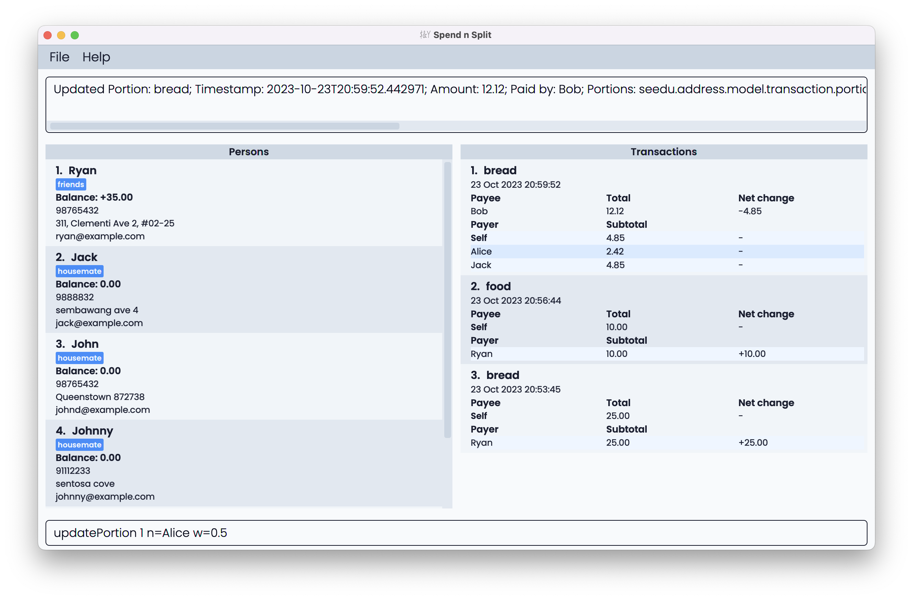

#### Deleting a transaction: `deleteTransaction`

Deletes the specified transaction based on index.

Format: `deleteTransaction INDEX`

* The index refers to the index number shown in the displayed transaction list. The index **must be a positive integer** 1, 2, 3, ...

Examples:

* `deleteTransaction 1`
    * Deletes the first transaction in the list

Sample Execution:

```
$ deleteTransaction 4

Deleted Transaction: Group Project Lunch; Timestamp: 2023-10-13T12:34:56.789; Amount: 60.00; Paid by: Self; Portions: [name: Benson Meier, weight: 4.00][name: Alice Pauline, weight: 2.00]
```

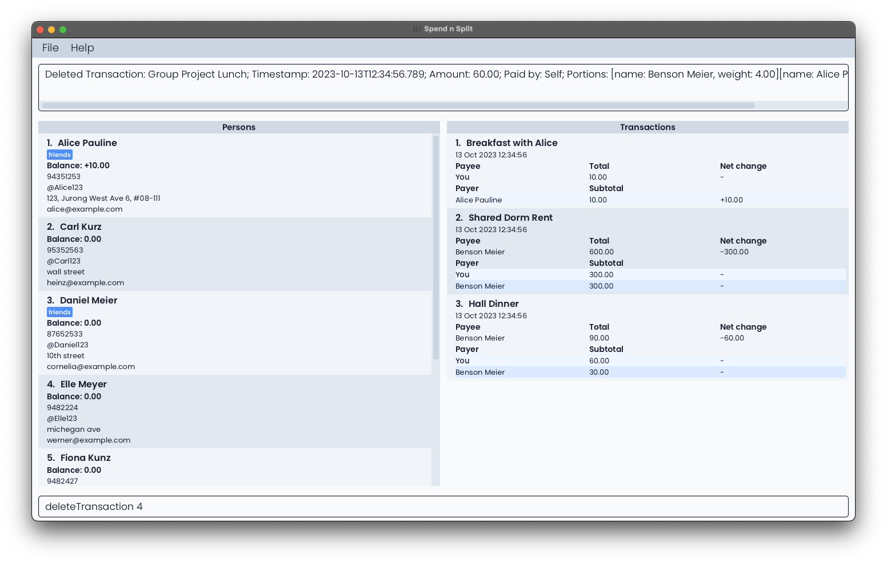

#### Duplicating a Transaction: `duplicateTransaction`

Duplicates the transaction at the specified `INDEX`. The duplicated transaction's timestamp will be the time at which
this command is executed. The index refers to the index number when viewing the TransactionList.
The index **must be a positive integer** 1, 2, 3, ...

Transaction details that can be changed when duplicating:

* Description
* Cost
* Payee

Format: `duplicateTransaction INDEX [d=DESCRIPTION] [c=COST] [n=PAYEE] [ts=TIME]`

The order of the flagged fields (i.e. those with the = sign) is flexible (e.g. description can come after cost) but the command word (duplicateTransaction) and the index must be in front.

Examples:

* `duplicateTransaction 1 c=12.12`
  * Creates a new transaction that is identical to the current transaction at index one in the Transaction panel,
  except for the timestamp of the new transaction being the time at which this command was executed
  and the cost bring 12.12 instead.
* `duplicateTransaction 2 d=Potato n=Bob`
  * Creates a new transaction that is identical to the current transaction at index two in the Transaction panel,
    except for the timestamp of the new transaction being the time at which this command was executed, the
    description of the new transaction being "Potato" and the payee of the new transaction being Bob.

#### Listing transactions: `listTransaction`

Shows a list of transactions whose descriptions include any of the keywords and which include any of the specified people. If no keywords are specified, it filters only by names; if no names are specified, it filters only by keywords. If neither are specified, all transactions will be lised.

Format: `listTransaction [KEYWORD]... [n=NAME]...`

* The name refers to the name of the person in the transaction (either as a payee or a payer).
* The name must contain only alphabets, numbers, and spaces. It cannot be empty and is case-insensitive.

Examples:

* `listTransaction`
    * Shows all transactions
* `listTransaction n=Alice Pauline n=Carl Kurz`
    * Shows all transactions that include Alice Pauline or Carl Kurz

Sample Execution:

```
$ listTransaction

5 transactions listed!
```

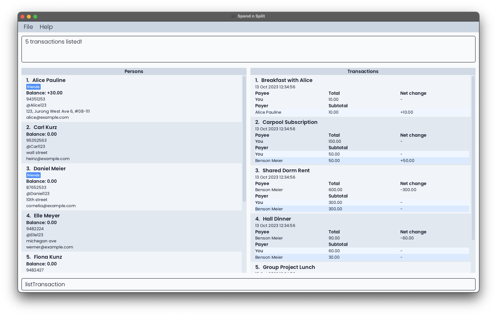

```
$ listTransaction n=Alice Pauline n=Carl Kurz

2 transactions listed!
```

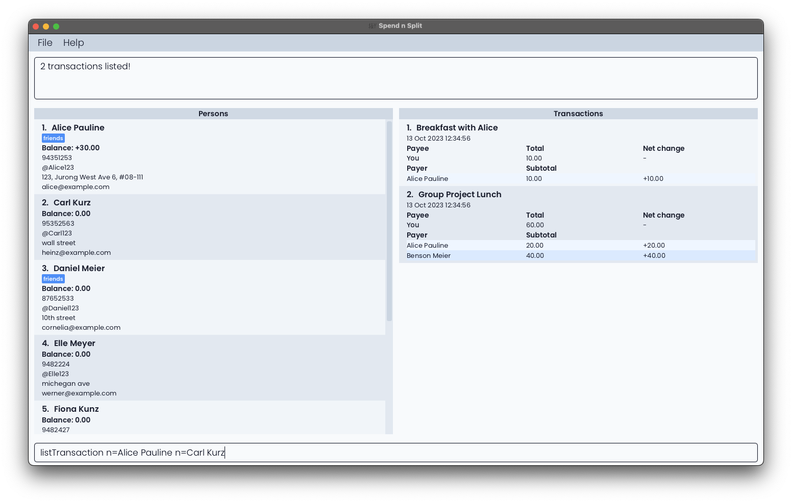

### Settling transactions: `settlePerson`

Settles the outstanding balance with a given person based on transactions that occur before or at the given timestamp.
If no timestamp is given, the default timestamp is the current system time.
If only the date is given, the default time is set as 23:59.

Format: `settlePerson INDEX [ts=TIME]`

Example:

*  `settlePerson 1` settles the outstanding balance with the 2nd person in the displayed list.

Sample Execution:

```
$ settlePerson

Invalid command format!
settlePerson: Settle any outstanding balance with another person. Parameters: INDEX (must be a positive integer)
Example: settlePerson 1

$ settlePerson 1

Balance settled: Alex Yeoh
```


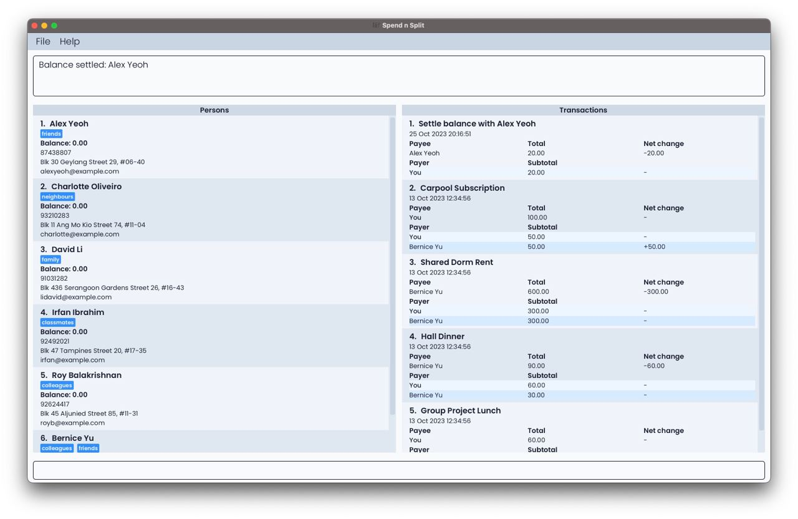

### Other features

#### Setting shorthands for commands : `setShorthand`

Sets a shorthand for the original command. In the future, this shorthand can be used in place of the original command.

Format: `setShorthand o=[ORIGINAL_COMMAND] s=[SHORTHAND]`

Note: The order of the fields is flexible (e.g. shorthand can come before the original command) but the command word (setShorthand) must be in front.

Commands and shorthands are case-sensitive.

#### Getting help : `help`

Displays a URL that contains a link to this user guide.

Format: `help`

#### Clearing all entries : `clear`

Clears all entries from the spendnsplit book.

Format: `clear`

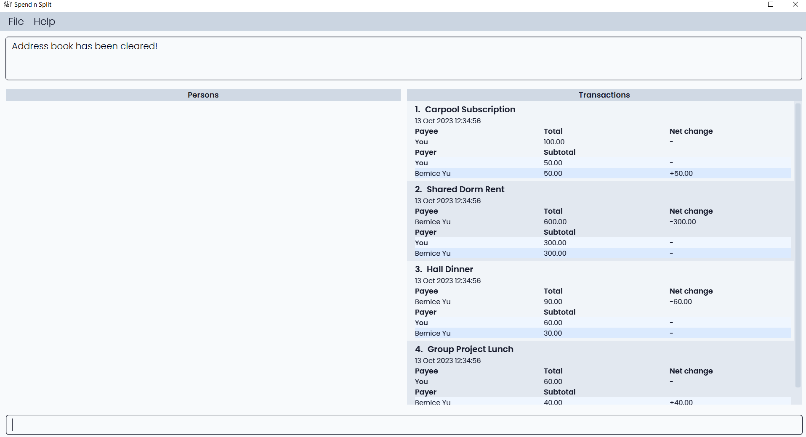

#### Exiting the program : `exit`

Exits the program.

Format: `exit`

#### Navigating the app using only the keyboard
You can use the following shortcuts to navigate our application:
- Selecting Result Display: [<kbd>ALT</kbd> (Windows/Linux) / <kbd>OPTION</kbd> (Mac)] + <kbd>UP ARROW KEY</kbd>
- Selecting Persons List: [<kbd>ALT</kbd> (Windows/Linux) / <kbd>OPTION</kbd> (Mac)] + <kbd>LEFT ARROW KEY</kbd>
- Selecting Transactions List: [<kbd>ALT</kbd> (Windows/Linux) / <kbd>OPTION</kbd> (Mac)] + <kbd>RIGHT ARROW KEY</kbd>
- Selecting Command Box: [<kbd>ALT</kbd> (Windows/Linux) / <kbd>OPTION</kbd> (Mac)] + <kbd>DOWN ARROW KEY</kbd>

For our result display, persons list and transaction list, once selected, you can use the <kbd>UP ARROW KEY</kbd> or <kbd>DOWN ARROW KEY</kbd> for scrolling.

#### Saving the data

Data is saved in the hard disk automatically after any command that changes the data. There is no need
to save manually.

#### Editing the data file

Data is saved automatically as a JSON file `[JAR file location]/data/spendnsplitbook.json`. The data is human-readable. However, be warned that the app may wipe the data or behave unexpectedly if the data is not edited correctly.

--------------------------------------------------------------------------------------------------------------------

## FAQ

### 1) Why do the portions in the log not add up exactly to the balance?

The portions displayed are rounded to a fixed number of decimal places. This means there may be fractional differences
between the actual portions and what is displayed. Values are rounded to 2 decimal places (i.e. 0.149 will be rounded down to 0.14,
and 0.145 will be rounded up to 0.15). The positive and negative signs will still be kept (i.e. -0.0000001 will be rounded
down to -0.00, and -1.015 will be rounded up to -1.02).

Example:

```
If these are the logs stored:
A:      0.122345
B:      0.223231
Total:  0.345123

This is displayed instead in the application due to rounding off to 2 decimal places:
A:      0.12
B:      0.22
Total:  0.35
```
### 2) What happens when I enter an invalid command?

When an invalid command is input, an error message will be reflected at the
output panel at the top of Spend n Split. The error message will vary depending on the type of error.

* Invalid command format. This occurs when the command word
is recognised but there are missing fields or the values provided in the fields are
not supported.
The error message reflected
will state `Invalid command format!`,
before giving details on the command and
the fields required, along with an example of a correct command
input with the fields required.
    * Example: `settlePerson -1`
      * Error message:
    ```
    Invalid command format!
    settlePerson: Settle any outstanding balance with another person. Parameters: INDEX (must be a positive integer)
    Example: settlePerson 1
    ```
* Unknown command. This occurs when the command word is not recognised.
The error message reflected will state `Unknown command`.
  * Example: `settleTransaction n=Ryan tg=@ryanzzzzz`
    * Error message:
  ```
  Unknown command
  ```
* Invalid command fields. This occurs when the invalid fields are provided
for the valid command word. The error message reflected is dependent on the
valid command word.
  * Example: `settlePerson 6` when there are only 5 people in the Persons List.
    * Error message:
  ```
  The person index provided is invalid
  ```
